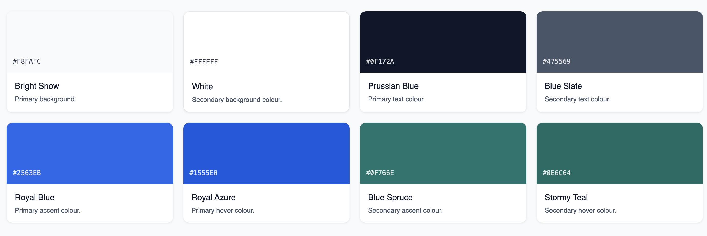
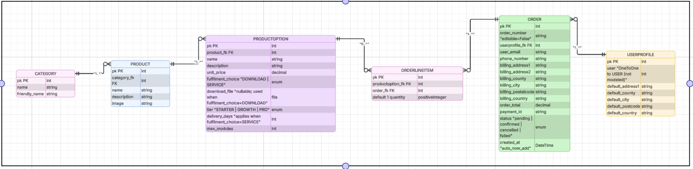
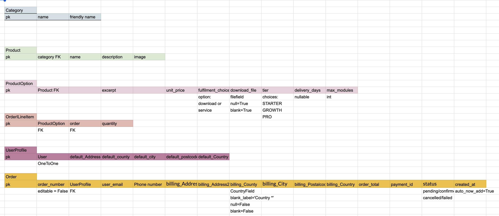
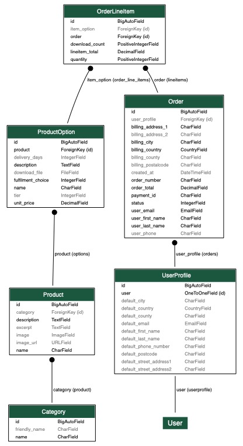
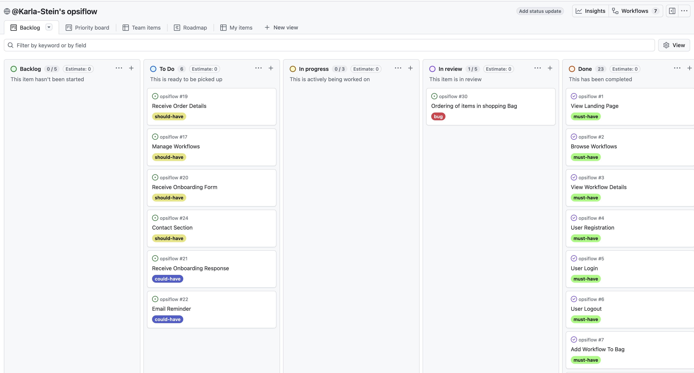
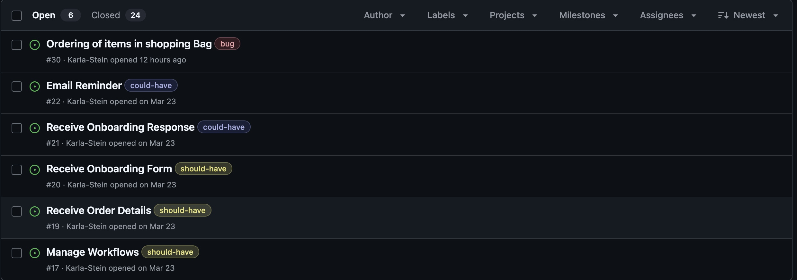
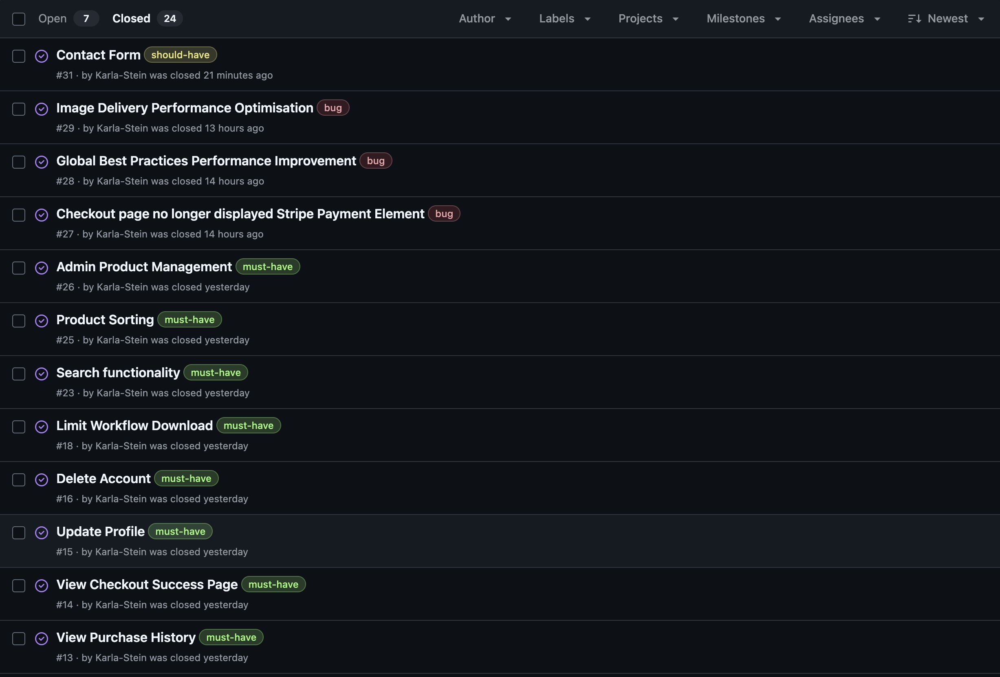
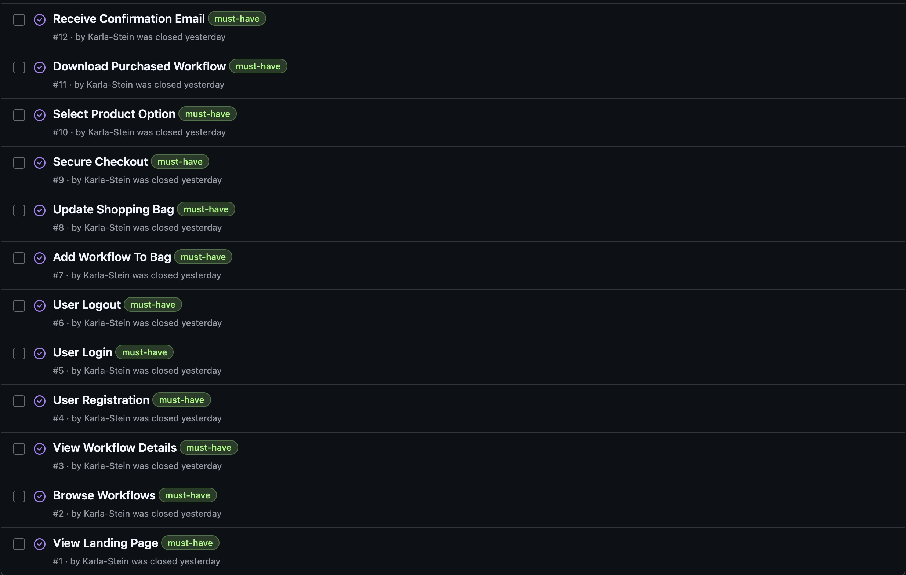

# [opsiflow](https://opsiflow-952bb478dd9c.herokuapp.com)

Developer: Karla Steinbrink ([Karla-Stein](https://www.github.com/Karla-Stein))

[](https://www.github.com/Karla-Stein/opsiflow/commits/main)
[](https://www.github.com/Karla-Stein/opsiflow/commits/main)
[](https://www.github.com/Karla-Stein/opsiflow)
[](https://opsiflow-952bb478dd9c.herokuapp.com)

## Project Links

| Resource | Link |
| --- | --- |
| Live Site | https://opsiflow-952bb478dd9c.herokuapp.com/ |
| Repository | https://github.com/Karla-Stein/opsiflow |


## PROJECT INTRODUCTION AND RATIONALE

Many businesses struggle with repetitive administrative tasks that reduce productivity and limit growth. This project is a web-based e-commerce platform designed to help entrepreneurs and small to medium-sized businesses streamline their operations through workflow automation. The platform allows users to explore automation concepts by browsing and purchasing ready-to-use workflow templates, which  serve as an accessible introduction to automation tools and processes. While these templates provide immediate practical value, the primary goal of the platform is to connect businesses with tailored automation solutions offered as a service. Users can therefore either implement templates independently using downloadable setup guides or request customised automation systems designed to meet their specific operational needs.


**Site Mockups**


source: [opsiflow amiresponsive](https://ui.dev/amiresponsive?url=https://opsiflow-952bb478dd9c.herokuapp.com)


## UX

### The 5 Planes of UX

#### 1. Strategy

**Purpose**

- Provide businesses with access to workflow automation templates and custom automation services to reduce repetitive administrative tasks.
- Offer an intuitive platform where users can explore, understand and implement automation solutions to improve efficiency and productivity.

**Primary User Needs**

- Business owners need simple and ready-to-use automation templates to quickly streamline repetitive processes.
- Users seeking advanced solutions need access to tailored automation services that fit their specific operational requirements.
- All users need a clear and user-friendly platform to browse automations, understand their benefits and complete secure purchases.

**Business Goals**

- Position the platform as a reliable source for automation solutions.
- Convert users from template buyers into higher-value service clients.
- Demonstrate the value of automation in improving efficiency, scalability and time management for businesses.

#### 2. Scope

**[Features](#features)** (see below)

**Content Requirements**

- Backend product management (create, update, delete and display workflow templates and service offerings).
- Public home page.
- Public product browsing page.
- Search and sort functionality.
- Detailed product pages with clear descriptions, benefits and options to choose from.
- User account functionality (register, log in, log out, view purchase history and manage profile details).
- A log in required purchase process. 
- Secure checkout system with the ability to add, update, or remove items from a shopping bag.
- Digital product delivery (downloadable templates with setup instructions and email confirmation).
- Download limitation system to restrict distribution of purchased templates.
- Order confirmation and success pages for both digital downloads and service bookings.
- 404 error page to handle invalid or broken URLs.

#### 3. Structure

**Information Architecture**
- **Navigation Menu**:
    - Links to Home, Workflows, Shopping Bag, My Purchases, My Details, Account deletion and authentication pages (Sign Up, Sign In and Sign Out).
    - Authenticated users can access their purchase history and secure download area through the profile section.
    - Superusers have access to product management functionality for creating and managing automation products and workflow options.

- **Hierarchy**:
    - Prominent workflow categories, filters and searchbar for easy navigation.
    - Bag and checkout options displayed prominently for convenience.


**User Flow**
1. Guest user browse the platform, explore workflow products through category filtering, sorting and detailed product pages.
2. Guest user adds products or services to the shopping bag and is redirected to required sign up or log in.
3. User creates an account or signs in to proceed with checkout.
4. Customer completes payment through Stripe, is redirected to successpage after successfull payment intent and receives an order confirmation email.
5. Customer can now access their purchases page to download purchased workflow templates securely or view their previous purchases.
6. Customer can review, update or delete their profile.
7. Superusers manage platform content through the Django admin panel. Create, update and delete automation products, workflow options and service offerings.
8. Users attempting to access invalid URLs are redirected to a custom 404 error page to help maintain navigation flow and usability.

#### 4. Skeleton

**[Wireframes](#wireframes)** (see below)

#### 5. Surface

**Visual Design Elements**
- **[Colours](#colour-scheme)** (see below)
- **[Typography](#typography)** (see below)

### Colour Scheme

| Colour | Hex | Purpose | 
| --- | --- | --- | 
| Bright Snow | `#F8FAFC` | Primary background. | 
| White | `#FFFFFF` | Secondary background colour. |
| Prussian Blue | `#0F172A` | Primary text colour. |
| Blue Slate | `#475569` | Secondary text colour. |
| Royal Blue | `#2563EB` | Primary accent colour. |
| Royal Azure | `#1555E0 `| Primary hover colour. |
| Blue Spruce | `#0F766E` | Secondary accent colour. |
| Stormy Teal | `#0E6C64` | Secondary hover colour. |



This palette was chosen to communicate several important qualities:
- Trust and stability through deep blues.
- Authority and professionalism through dark text tones.
- Innovation and modern technology through teal accents.
- Clarity and accessibility through light backgrounds and strong contrast.

The combination of these colours ensures that the interface remains minimal, professional and easy to read, while also aligning with the visual language commonly used in modern technology products.


### Typography

- [Inter](https://fonts.google.com/specimen/Inter) was used as the primary font throughout the application, particularly for body text and core interface elements, due to its strong readability and clean modern appearance across desktop and mobile devices.
- [DM Sans](https://fonts.google.com/specimen/DM+Sans) was used selectively for highlighted paragraphs and supporting content to create visual contrast while maintaining the minimalist aesthetic.
- [Font Awesome](https://fontawesome.com) icons were used throughout the application for interface elements such as shopping bag actions, downloads, navigation indicators and social media links.

## Wireframes

To follow best practice, wireframes were developed for mobile, tablet, and desktop sizes.
I've used [Balsamiq](https://balsamiq.com/wireframes) to design my site wireframes.

| Page | Mobile | Tablet | Desktop |
| --- | --- | --- | --- |
| Sign Up |  |  |  |
| Login |  |  |  |
| Home |  |  |  |
| Workflows|  |  |  |
| Workflow detail |  |  |  |
| Shopping bag |  |  |  |
| Checkout |  |  |  |
| Success page |  |  |  |
| 404 |  |  |  |


## User Stories

| Target | Expectation | Outcome |
| --- | --- | --- |
| As an anonymous user | I want to land on a clear homepage | so that I understand what the platform offers.|
| As an anonymous user | I want to browse available workflows | so that I can explore solutions before committing. |
| As an anonymous user|  I want to view workflow details | so that I understand what each automation does. |
| As an anonymous user| I want to create an account | so that I can use the websites features. |
| As a user | I want to log in securely | so that I can view my profile and purchases. |
| As a user | I can search for keywords | so that I quickly find what I am looking for.| 
| As a user | I want to sort products by price, name and complexity | so that I can quickly find products that best match my budget and requirements. |
| As a logged in user| I want to log out | so that my account remains secure. |
| As a logged in user | I want to add workflows to my bag | so that I can review before purchasing. |
| As a logged in user | I want to update or remove items from my bag | so that I stay in control of my purchase. |
| As a logged in user | I want to checkout securely | so that I can complete my purchase with confidence. |
| As a logged in user | I want to choose between template only or workflow & setup. | so that I can decide my level of support. |
| As a logged in user | I want to download my purchased workflow | so that I can use it immediately. |
| As a logged in user | I receive a confirmation email after purchase | so that I have a backup on instructions on how to proceed. |
| As a logged in user | I can navigate to my purchase history | so that I can view all my previous purchases in one place. |
| As a logged in user | I can see a checkout confirmation | so that I can trust that the checkout process was successful. |
| As a logged in user | I can update my profile | so that my profile is always accurate. |
| As a logged in user | I want to delete my account | so that I can stay in control of my data. |
| As a site owner | I want to limit downloads | so that my products are not distributed freely. |
| As a site superuser | I want to create, view, update and delete products, product options and categories | so that I can keep the product catalogue accurate and up to date. |


## Features

### Existing Features

| Feature | Notes | Screenshot |
| --- | --- | --- |
| Sign Up | Authentication is handled through django-allauth, allowing users to securely create accounts in order to purchase workflow templates, access downloads and manage their purchase history. |  |
| Sign In | Registered users can securely log in to access their purchases and profile information. |  |
| Sign Out | Users can securely log out of their accounts to protect their purchase and profile information. |  |
| Home Page | The landing page introduces the OpsiFlow platform and guides users towards browsing products and solutions. |  |
| Product Browsing | Users can browse all available automation templates and service offerings through a public product listing page with category filtering and sorting functionality. |  |
| Workflow Sorting | Users can sort workflow templates and automation services by criteria such as price, complexity and alphabetical order to quickly locate suitable solutions. |  |
| Search Functionality | A search bar allows users to quickly find products using keywords and product names. |  |
| Product Categories | Products are organised into categories to improve discoverability and allow users to browse relevant automation solutions more efficiently. |  |
| Product Detail Pages | Each product contains detailed information including workflow description, pricing, fulfilment options and delivery time expectations to help users choose the correct solution. |  |
| Option Switching | Users can dynamically switch between "DIY template" and “Set Up Service” fulfilment options, as well as "Starter", "Growth" or "Pro" tier options directly within the shopping bag. |   |
| Shopping Bag | Users can remove and update workflow products before checkout. |  |
| Dynamic Shopping Bag Icon | The navigation shopping bag icon dynamically updates to reflect the user’s current bag total, providing immediate feedback. |  |
| Offcanvas Navigation | An offcanvas navigation menu improves usability on smaller devices by providing an accessible mobile-first navigation experience. |  |
| Stripe Checkout | Stripe Checkout supports multiple payment methods, providing users with a secure and flexible payment experience during checkout. |  |
| Order Confirmation | Users receive an on-screen success page and confirmation email after successful payment completion. |   |
| Digital Downloads | Customers purchasing DIY workflow templates receive secure access to downloadable automation systems and setup resources. |  |
| Email link to downloads | Customers recieve a link via email that provides access to their purchase history and download links after successfull log in. |  |
| Download Limitation System | Purchased downloads are protected through a restricted download system designed to reduce unauthorised sharing and distribution. |  |
| Account Navigation Area | Authenticated users can access a dedicated account area for managing profile details, viewing purchases and account-related actions. |  |
| Purchase History | Authenticated users can access a dedicated purchases page to review previous orders and access purchased downloads. |  |
| Profile Management | Users can save and manage default checkout information to improve future purchasing experiences. |  |
| Delete Profile Confirmation Modal | A confirmation modal is displayed before deleting a user profile to help prevent accidental destructive actions. |  |
| Product Management | Superusers can create, edit and delete products, workflow options, fulfilment variations and categories through the Django admin interface. |  |
| Custom 404 Page | A custom 404 page was created to maintain brand consistency and guide users back into the application if an invalid URL is accessed. |  |


### Future Features

- **Site Owner Dashboard**:
    - A protected staff-only dashboard displaying recent customer orders, submitted onboarding forms, contact form submissions and workflow management section.
- **Workflow Management Section**: 
    - A front-end management area where categories, products and product options can be added, updated and deleted without relying solely on the Django admin panel.
- **Onboarding Forms**:
    - User purchasing “Set Up Service” options receive onboarding forms directly via email after their purchase.
- **Automated Reminder Emails**: 
    - Automatically send reminder emails to users who have purchased setup services but have not completed their onboarding forms.
- **Newsletter System**: 
    - A newsletter feature allowing users to subscribe to updates, workflow releases and platform announcements.
- **Blog Section**: 
    - A blog section focused on automation, AI workflows, operational efficiency and productivity content.
- **Product Ratings & Reviews**: 
    - Allow customers to leave ratings and reviews on workflow templates and services to improve social proof and user trust.
- **Subscription-based Learning Platform**: 
    - Subscription access to video-based educational content, workflow tutorials and a private community area.


## Tools & Technologies

| Tool / Tech | Use |
| --- | --- |
| [](https://markdown.2bn.dev) | Generate README and TESTING templates. |
| [](https://git-scm.com) | Version control. (`git add`, `git commit`, `git push`) |
| [](https://github.com) | Secure online code storage. |
| [](https://code.visualstudio.com) | Local IDE for development. |
| [](https://en.wikipedia.org/wiki/HTML) | Main site content and layout. |
| [](https://en.wikipedia.org/wiki/CSS) | Design and layout. |
| [](https://www.javascript.com) | User interaction on the site. |
| [](https://www.python.org) | Back-end programming language. |
| [](https://www.heroku.com) | Hosting the deployed back-end site. |
| [](https://getbootstrap.com) | Front-end CSS framework for modern responsiveness and pre-built components. |
| [](https://www.djangoproject.com) | Python framework for the site. |
| [](https://www.postgresql.org) | Relational database management. |
| [](https://whitenoise.readthedocs.io) | Serving static files with Heroku. |
| [](https://stripe.com) | Online secure payments of e-commerce products/services. |
| [](https://mail.google.com) | Sending emails in my application. |
| [](https://aws.amazon.com/s3) | Online static file storage. |
| [](https://balsamiq.com/wireframes) | Creating wireframes. |
| [](https://fontawesome.com) | Icons. |
| [](https://chat.openai.com) | Help debug, troubleshoot, and explain things. |
| [](https://www.w3schools.com) | Tutorials/Reference Guide |
| [](https://stackoverflow.com) | Troubleshooting and Debugging |
| [](https://developer.mozilla.org/) |Tutorials/Reference Guide  |
| [](https://favicon.io) | Generating the favicon. |
| [](https://fonts.google.com/) | Typography and brand icon. |
| [](https://lucid.app.com/) | Typography and icon resources used throughout the application. |
| [](https://www.youtube.com/) | Tutorials. |
| [](https://medium.com) | Articles. |
| [](https://lucid.app) | Planning the initial ERD |
| [](https://www.google.com/sheets/about/) | Refining the ERD |
| [](https://mermaid.live) | Creating an interactive version of the ERD |
| [](https://coolors.co/) | Used to generate the colour palette. |
| [](https://www.make.com/) | Used for workflow automation planning and business process inspiration. |
| [](https://docs.google.com/) | Text based set up guides.|
| [](https://www.notion.so/) | Project planning, README notes and course-related study notes throughout development. |
| [](https://squoosh.app/) | Image compression and optimisation for improved website performance and Lighthouse scores. |
| [](https://www.figma.com/) | Used to visualise and present the project's colour palette. |


## Database Design

### Data Model

The database structure was initially planned using both Lucidchart and Google Sheets.

Lucidchart was primarily used during the early planning phase to visually map relationships between models and create clear, presentation-friendly ERDs. Its visual structure helped with understanding the overall architecture and future scalability of the application.
Google Sheets was later used for analysing relationships, adjusting fields and validating the data structure, as it provided a simpler and more flexible environment. 
Using both tools allowed the database design to remain visually organised while also supporting practical development decisions.

### Database Design Evolution

| Stage | Tool | Purpose | ERD |
| --- | --- | --- | --- | 
| Initial Planned ERD | [](https://lucid.app/) | Used during the planning phase to visually design the application's relational database structure and map relationships between core models. |  |
| Refined Development ERD | [](https://www.google.com/sheets/about/) | Used during active development to simplify, validate and refine model relationships and database logic throughout implementation. |  |

#### Custom Application ERD 

I have used `pygraphviz` and `django-extensions` to auto-generate an ERD.

The steps taken were as follows:
- In the terminal: `brew install graphviz`
- then: `pip3 install django-extensions pygraphviz`
- in my `settings.py` file, I added the following to my `INSTALLED_APPS`:

```python
INSTALLED_APPS = [
    ...
    'django_extensions',
    ...
]
```

- back in the terminal: `python manage.py graph_models products checkout profiles -o erd.jpeg`
- drag the new files into my `documentation/` folder
- removed `'django_extensions',` from my `INSTALLED_APPS`
- finally, in the terminal: `pip3 uninstall django-extensions pygraphviz -y`


The diagram below shows the database structure for the custom models developed specifically for OpsiFlow. 
It illustrates the relationships between all custom modles providing a clear and final overview of the current application's core data architecture.



source: [medium.com](https://medium.com/@yathomasi1/1-using-django-extensions-to-visualize-the-database-diagram-in-django-application-c5fa7e710e16)


## Agile Development Process

### GitHub Projects

[GitHub Projects](https://www.github.com/Karla-Stein/opsiflow/projects) served as an Agile tool for this project. User stories were planned through it, then subsequently tracked on a regular basis using the Kanban project board.



### GitHub Issues

[GitHub Issues](https://www.github.com/Karla-Stein/opsiflow/issues) served as an another Agile tool. There, I managed my User Stories and tracked any issues/bugs.

| Link | Screenshot |
| --- | --- |
| [](https://www.github.com/Karla-Stein/opsiflow/issues?q=is%3Aissue%20is%3Aopen%20-label%3Abug) |  |
| [](https://www.github.com/Karla-Stein/opsiflow/issues?q=is%3Aissue%20is%3Aclosed%20-label%3Abug) |   |


### MoSCoW Prioritisation

Project Epics were broken down into individual User Stories and prioritised using the MoSCoW framework. Each User Story was tracked and labelled within GitHub Issues to clearly define scope and development focus for the MVP.

- **Must Have**: Core functionality required for the MVP and project submission. These features are essential for the platform to function.
- **Should Have**: High-value features that significantly improve usability and workflow but are not strictly required for MVP completion.
- **Could Have**: Valuable enhancements that were intentionally scoped out of the MVP due to time and complexity, but are planned for future development (e.g. visitor authentication).
- **Won’t Have**: Features explicitly excluded from the current development iteration and outside the scope of the MVP.


## Testing

> [!NOTE]  
> For all testing, please refer to the [TESTING.md](TESTING.md) file.


## Deployment

The live deployed application can be found deployed on [Heroku](https://opsiflow-952bb478dd9c.herokuapp.com).

### Heroku Deployment

This project uses [Heroku](https://www.heroku.com), a platform as a service (PaaS) that enables developers to build, run, and operate applications entirely in the cloud.
Deployment steps are as follows, after account setup:

- Select **New** in the top-right corner of your Heroku Dashboard, and select **Create new app** from the dropdown menu.
- Your app name must be unique, and then choose a region closest to you (EU or USA), then finally, click **Create App**.
- From the new app **Settings**, click **Reveal Config Vars**, and set your environment variables to match your private `env.py` file.

> [!IMPORTANT]  
> This is a sample only; you would replace the values with your own if cloning/forking my repository.

| Key | Value |
| --- | --- |
| `AWS_ACCESS_KEY_ID` | user-inserts-own-aws-access-key-id |
| `AWS_SECRET_ACCESS_KEY` | user-inserts-own-aws-secret-access-key |
| `DATABASE_URL` | user-inserts-own-postgres-database-url |
| `DISABLE_COLLECTSTATIC` | 1 (*this is temporary, and can be removed for the final deployment*) |
| `EMAIL_HOST_PASS` | user-inserts-own-gmail-api-key |
| `EMAIL_HOST_USER` | user-inserts-own-gmail-email-address |
| `SECRET_KEY` | any-random-secret-key |
| `STRIPE_PUBLIC_KEY` | user-inserts-own-stripe-public-key |
| `STRIPE_SECRET_KEY` | user-inserts-own-stripe-secret-key |
| `STRIPE_WH_SECRET` | user-inserts-own-stripe-webhook-secret |
| `USE_AWS` | True |

Heroku needs some additional files in order to deploy properly.

- [requirements.txt](requirements.txt)
- [Procfile](Procfile)
- [.python-version](.python-version)

You can install this project's **[requirements.txt](requirements.txt)** (*where applicable*) using:

- `pip3 install -r requirements.txt`

If you have your own packages that have been installed, then the requirements file needs updated using:

- `pip3 freeze --local > requirements.txt`

The **[Procfile](Procfile)** can be created with the following command:

- `echo web: gunicorn app_name.wsgi > Procfile`
- *replace `app_name` with the name of your primary Django app name; the folder where `settings.py` is located*

The **[.python-version](.python-version)** file tells Heroku the specific version of Python to use when running your application.

- `3.12` (or similar)

For Heroku deployment, follow these steps to connect your own GitHub repository to the newly created app:

Either (*recommended*):

- Select **Automatic Deployment** from the Heroku app.

Or:

- In the Terminal/CLI, connect to Heroku using this command: `heroku login -i`
- Set the remote for Heroku: `heroku git:remote -a app_name` (*replace `app_name` with your app name*)
- After performing the standard Git `add`, `commit`, and `push` to GitHub, you can now type:
	- `git push heroku main`

The project should now be connected and deployed to Heroku!

### PostgreSQL

This project uses a [Code Institute PostgreSQL Database](https://dbs.ci-dbs.net) for the Relational Database with Django.

> [!CAUTION]
> - PostgreSQL databases by Code Institute are only available to CI Students.
> - You must acquire your own PostgreSQL database through some other method if you plan to clone/fork this repository.
> - Code Institute students are allowed a maximum of 8 databases.
> - Databases are subject to deletion after 18 months.

To obtain my own Postgres Database from Code Institute, I followed these steps:

- Submitted my email address to the CI PostgreSQL Database link above.
- An email was sent to me with my new Postgres Database.
- The Database connection string will resemble something like this:
    - `postgres://<db_username>:<db_password>@<db_host_url>/<db_name>`
- You can use the above URL with Django; simply paste it into your `env.py` file and Heroku Config Vars as `DATABASE_URL`.


### Amazon AWS

This project uses [AWS](https://aws.amazon.com) to store media and static files online, due to the fact that Heroku doesn't persist this type of data.

Once you've created an AWS account and logged-in, follow these series of steps to get your project connected. Make sure you're on the **AWS Management Console** page.

#### S3 Bucket

- Search for **S3**.
- Create a new bucket, give it a name (e.g. matching your Heroku app name), and choose the region closest to you.
- Uncheck **Block all public access**, and acknowledge that the bucket will be public (*required* for it to work on Heroku).
- From **Object Ownership**, make sure to have **ACLs enabled**, and **Bucket owner preferred** selected.
- From the **Properties** tab, turn on static website hosting, and type `index.html` and `error.html` in their respective fields, then click **Save**.
- From the **Permissions** tab, paste in the following CORS configuration:

	```shell
	[
		{
			"AllowedHeaders": [
				"Authorization"
			],
			"AllowedMethods": [
				"GET"
			],
			"AllowedOrigins": [
				"*"
			],
			"ExposeHeaders": []
		}
	]
	```

- Copy your **ARN** string.
- From the **Bucket Policy** tab, select the **Policy Generator** link, and use the following steps:
	- Policy Type: **S3 Bucket Policy**
	- Effect: **Allow**
	- Principal: `*`
	- Actions: **GetObject**
	- Amazon Resource Name (ARN): **paste-your-ARN-here**
	- Click **Add Statement**
	- Click **Generate Policy**
	- Copy the entire Policy, and paste it into the **Bucket Policy Editor**

		```shell
		{
			"Id": "Policy1234567890",
			"Version": "2012-10-17",
			"Statement": [
				{
					"Sid": "Stmt1234567890",
					"Action": [
						"s3:GetObject"
					],
					"Effect": "Allow",
					"Resource": "arn:aws:s3:::your-bucket-name/*"
					"Principal": "*",
				}
			]
		}
		```

	- Before you click "Save", add `/*` to the end of the Resource key in the Bucket Policy Editor (*like above*).
	- Click **Save**.
- From the **Access Control List (ACL)** section, click "Edit" and enable **List** for **Everyone (public access)**, and accept the warning box.
	- If the edit button is disabled, you need to change the **Object Ownership** section above to **ACLs enabled** (*mentioned above*).


#### IAM

Back on the AWS Services Menu, search for and open **IAM** (Identity and Access Management). Once on the IAM page, follow these steps:

- From **User Groups**, click **Create New Group**.
	- Suggested Name: `group-opsiflow` (*group + the project name*)
- Tags are optional, but you must click it to get to the **review policy** page.
- From **User Groups**, select your newly created group, and go to the **Permissions** tab.
- Open the **Add Permissions** dropdown, and click **Attach Policies**.
- Select the policy, then click **Add Permissions** at the bottom when finished.
- From the **JSON** tab, select the **Import Managed Policy** link.
	- Search for **S3**, select the `AmazonS3FullAccess` policy, and then **Import**.
	- You'll need your ARN from the S3 Bucket copied again, which is pasted into "Resources" key on the Policy.

		```shell
		{
			"Version": "2012-10-17",
			"Statement": [
				{
					"Effect": "Allow",
					"Action": "s3:*",
					"Resource": [
						"arn:aws:s3:::your-bucket-name",
						"arn:aws:s3:::your-bucket-name/*"
					]
				}
			]
		}
		```
	
	- Click **Review Policy**.
	- Suggested Name: `policy-opsiflow` (*policy + the project name*)
	- Provide a description:
		- "Access to S3 Bucket for opsiflow static files."
	- Click **Create Policy**.
- From **User Groups**, click your "group-opsiflow".
- Click **Attach Policy**.
- Search for the policy you've just created ("policy-opsiflow") and select it, then **Attach Policy**.
- From **User Groups**, click **Add User**.
	- Suggested Name: `user-opsiflow` (*user + the project name*)
- For "Select AWS Access Type", select **Programmatic Access**.
- Select the group to add your new user to: `group-opsiflow`
- Tags are optional, but you must click it to get to the **review user** page.
- Click **Create User** once done.
- You should see a button to **Download .csv**, so click it to save a copy on your system.
	- **IMPORTANT**: once you pass this page, you cannot come back to download it again, so do it immediately!
	- This contains the user's **Access key ID** and **Secret access key**.
	- `AWS_ACCESS_KEY_ID` = **Access key ID**
	- `AWS_SECRET_ACCESS_KEY` = **Secret access key**

#### Final AWS Setup

- If Heroku Config Vars has `DISABLE_COLLECTSTATIC` still, this can be removed now, so that AWS will handle the static files.
- Back within **S3**, create a new folder called: `media`.
- Select any existing media images for your project to prepare them for being uploaded into the new folder.
- Under **Manage Public Permissions**, select **Grant public read access to this object(s)**.
- No further settings are required, so click **Upload**.

### Stripe API

This project uses [Stripe](https://stripe.com) to handle the ecommerce payments.

Once you've created a Stripe account and logged-in, follow these series of steps to get your project connected.

- From your Stripe dashboard, click to expand the "Get your test API keys".
- You'll have two keys here:
	- `STRIPE_PUBLIC_KEY` = Publishable Key (starts with **pk**)
	- `STRIPE_SECRET_KEY` = Secret Key (starts with **sk**)

As a backup, in case users prematurely close the purchase-order page during payment, we can include Stripe Webhooks.

- From your Stripe dashboard, click **Developers**, and select **Webhooks**.
- From there, click **Add Endpoint**.
	- `https://opsiflow-952bb478dd9c.herokuapp.com/checkout/wh/`
- Click **receive all events**.
- Click **Add Endpoint** to complete the process.
- You'll have a new key here:
	- `STRIPE_WH_SECRET` = Signing Secret (Wehbook) Key (starts with **wh**)

### Gmail API

This project uses [Gmail](https://mail.google.com) to handle sending emails to users for purchase order confirmations.

Once you've created a Gmail (Google) account and logged-in, follow these series of steps to get your project connected.

- Click on the **Account Settings** (cog icon) in the top-right corner of Gmail.
- Click on the **Accounts and Import** tab.
- Within the section called "Change account settings", click on the link for **Other Google Account settings**.
- From this new page, select **Security** on the left.
- Select **2-Step Verification** to turn it on. (*verify your password and account*)
- Once verified, select **Turn On** for 2FA.
- Navigate back to the **Security** page, and you'll see a new option called **App passwords** (*search for it at the top, if not*).
- This might prompt you once again to confirm your password and account.
- Select **Mail** for the app type.
- Select **Other (Custom name)** for the device type.
    - Any custom name, such as "Django" or `opsiflow`
- You'll be provided with a 16-character password (API key).
    - Save this somewhere locally, as you cannot access this key again later!
    - If your 16-character password contains *spaces*, make sure to remove them entirely.
    - `EMAIL_HOST_PASS` = user's 16-character API key
    - `EMAIL_HOST_USER` = user's own personal Gmail email address


### WhiteNoise

This project uses the [WhiteNoise](https://whitenoise.readthedocs.io/en/latest/) to aid with static files temporarily hosted on the live Heroku site.

To include WhiteNoise in your own projects:

- Install the latest WhiteNoise package:
    - `pip install whitenoise`
- Update the `requirements.txt` file with the newly installed package:
    - `pip freeze --local > requirements.txt`
- Edit your `settings.py` file and add WhiteNoise to the `MIDDLEWARE` list, above all other middleware (apart from Django’s "SecurityMiddleware"):

```python
# settings.py

MIDDLEWARE = [
    'django.middleware.security.SecurityMiddleware',
    'whitenoise.middleware.WhiteNoiseMiddleware',
    # any additional middleware
]
```

### Local Development

This project can be cloned or forked in order to make a local copy on your own system.

For either method, you will need to install any applicable packages found within the [requirements.txt](requirements.txt) file.

- `pip3 install -r requirements.txt`.

You will need to create a new file called `env.py` at the root-level, and include the same environment variables listed above from the Heroku deployment steps.

> [!IMPORTANT]  
> This is a sample only; you would replace the values with your own if cloning/forking my repository.

Sample `env.py` file:

```python
import os

os.environ.setdefault("AWS_ACCESS_KEY_ID", "user-inserts-own-aws-access-key-id")
os.environ.setdefault("AWS_SECRET_ACCESS_KEY", "user-inserts-own-aws-secret-access-key")
os.environ.setdefault("DATABASE_URL", "user-inserts-own-postgres-database-url")
os.environ.setdefault("EMAIL_HOST_PASS", "user-inserts-own-gmail-host-api-key")
os.environ.setdefault("EMAIL_HOST_USER", "user-inserts-own-gmail-email-address")
os.environ.setdefault("SECRET_KEY", "any-random-secret-key")
os.environ.setdefault("STRIPE_PUBLIC_KEY", "user-inserts-own-stripe-public-key")
os.environ.setdefault("STRIPE_SECRET_KEY", "user-inserts-own-stripe-secret-key")
os.environ.setdefault("STRIPE_WH_SECRET", "user-inserts-own-stripe-webhook-secret")  # only if using Stripe Webhooks

# local environment only (do not include these in production/deployment!)
os.environ.setdefault("DEBUG", "True")
os.environ.setdefault("DEVELOPMENT", "True")
```

Once the project is cloned or forked, in order to run it locally, you'll need to follow these steps:

- Start the Django app: `python3 manage.py runserver`
- Stop the app once it's loaded: `CTRL+C` (*Windows/Linux*) or `⌘+C` (*Mac*)
- Make any necessary migrations: `python3 manage.py makemigrations --dry-run` then `python3 manage.py makemigrations`
- Migrate the data to the database: `python3 manage.py migrate --plan` then `python3 manage.py migrate`
- Create a superuser: `python3 manage.py createsuperuser`
- Load fixtures (*if applicable*): `python3 manage.py loaddata file-name.json` (*repeat for each file*)
- Everything should be ready now, so run the Django app again: `python3 manage.py runserver`

If you'd like to backup your database models, use the following command for each model you'd like to create a fixture for:

- `python3 manage.py dumpdata your-model > your-model.json`
- *repeat this action for each model you wish to backup*
- **NOTE**: You should never make a backup of the default *admin* or *users* data with confidential information.

#### Cloning

You can clone the repository by following these steps:

1. Go to the [GitHub repository](https://www.github.com/Karla-Stein/opsiflow).
2. Locate and click on the green "Code" button at the very top, above the commits and files.
3. Select whether you prefer to clone using "HTTPS", "SSH", or "GitHub CLI", and click the "copy" button to copy the URL to your clipboard.
4. Open "Git Bash" or "Terminal".
5. Change the current working directory to the location where you want the cloned directory.
6. In your IDE Terminal, type the following command to clone the repository:
	- `git clone https://www.github.com/Karla-Stein/opsiflow.git`
7. Press "Enter" to create your local clone.

Alternatively, if using Ona (formerly Gitpod), you can click below to create your own workspace using this repository.

[](https://gitpod.io/#https://www.github.com/Karla-Stein/opsiflow)

**Please Note**: in order to directly open the project in Ona (Gitpod), you should have the browser extension installed. A tutorial on how to do that can be found [here](https://www.gitpod.io/docs/configure/user-settings/browser-extension).

#### Forking

By forking the GitHub Repository, you make a copy of the original repository on our GitHub account to view and/or make changes without affecting the original owner's repository. You can fork this repository by using the following steps:

1. Log in to GitHub and locate the [GitHub Repository](https://www.github.com/Karla-Stein/opsiflow).
2. At the top of the Repository, just below the "Settings" button on the menu, locate and click the "Fork" Button.
3. Once clicked, you should now have a copy of the original repository in your own GitHub account!


### Local VS Deployment

There are no remaining major differences between the local version when compared to the deployed version online.


## Credits

### Content

| Source | Notes |
| --- | --- |
| [Markdown Builder](https://markdown.2bn.dev) | Help generating Markdown files |
| [Boutique Ado](https://codeinstitute.net) | Code Institute walkthrough project inspiration |
| [Bootstrap](https://getbootstrap.com) | Various components / responsive front-end framework |
| [AWS S3](https://aws.amazon.com/s3) | Cloud storage for static/media files |
| [Whitenoise](https://whitenoise.readthedocs.io) | Static file service |
| [Stripe](https://docs.stripe.com/payments/accept-a-payment?payment-ui=elements&api-integration=paymentintents) | Stripe payment element |
| [Gmail API](https://developers.google.com/gmail/api/guides) | Sending payment confirmation emails |
| [ChatGPT](https://chatgpt.com) | Help with code logic and explanations |
| [Django Docs](https://docs.djangoproject.com/en/6.0/howto/csrf/) | CSRF protection wit AJAX |
| [Django Docs](https://docs.djangoproject.com/en/4.2/ref/models/instances/) | Custom model validation |
| [Django Docs](https://docs.djangoproject.com/en/6.0/topics/email/) | Sending emails |
| [Make.com](https://www.make.com/en) | JSON blueprints - digital product |
| [Google Docs](https://docs.google.com) | Set up instructions - digital product |
| [Chat GPT](https://chatgpt.com) | Content for Set up instructions - digital product |

### Media

| Source | Notes |
| --- | --- |
| [Make.com](https://www.make.com/en) | Workflow screenshots used throughout the project were created and captured from my own private Make.com account. |
| [Magnific](https://www.magnific.com/search?format=search&last_filter=query&last_value=workflows&query=workflows#uuid=75aee66e-507f-4e1e-a00d-2290a974e2c7) | Custom workflow image |
| [Magnific](https://www.magnific.com/search?format=search&last_filter=query&last_value=placeholder&query=placeholder#uuid=4a90ddc5-70c1-4e1f-bb4f-5c9a8e1990d5) | Placeholder image |
| [Google Fonts](https://fonts.google.com/icons?icon.query=automation) | Brand Icon |
| [Font Awesome](https://fontawesome.com) | Icons used throughout the application |
| [favicon.io](https://favicon.io) | Generating the favicon |
| [Google Fonts](https://fonts.google.com/) | Typography |
| [Coolors](https://coolors.co) | Colour palette inspiration |


### Testing
| Source | Notes |
| --- | --- |
| [Real Python](https://realpython.com/python-mock-library/#what-is-mocking) | My introduction into mocking and the patch() decorator |
| [Kinsacreative](https://blog.kinsacreative.com/articles/unit-testing-file-objects-django/) | Unit testing with files |
| [Bharat Chauhan](https://bhch.github.io/posts/2018/12/django-how-to-clean-up-images-and-temporary-files-created-during-testing/) | How to add and remove temporary files |
| [Django docs](https://docs.djangoproject.com/en/6.0/topics/testing/tools/#django.test.override_settings) | Override settings to create a temporary folder |


### Acknowledgements

- I would like to thank my former Code Institute mentor, [Tim Nelson](https://www.github.com/TravelTimN), to introduce me to the Markdown builder.
- I would also like to thank [Code Institute](https://codeinstitute.net) for the course content, walkthrough projects and learning materials that helped me develop my technical and problem-solving skills throughout this journey.
- A special thank you to [Richey Malhotra](https://github.com/richey-malhotra) for the additional support and guidance he provided throughout this project. He consistently went above and beyond to help our cohort succeed, including offering valuable 1:1 support sessions outside of the standard teaching provided. His support contributed significantly to both my learning experience and confidence throughout development.


