# opsiflow

PROJECT INTRODUCTION AND RATIONALE

Many businesses struggle with repetitive administrative tasks that reduce productivity and limit growth. This project is a web-based e-commerce platform designed to help entrepreneurs and small to medium-sized businesses streamline their operations through workflow automation. The platform allows users to explore automation concepts by browsing and purchasing ready-to-use workflow templates, which  serve as an accessible introduction to automation tools and processes. While these templates provide immediate practical value, the primary goal of the platform is to connect businesses with tailored automation solutions offered as a service. Users can therefore either implement templates independently using downloadable setup guides or request customised automation systems designed to meet their specific operational needs.

## UX

### The 5 Planes of UX

#### 1. Strategy

**Purpose**

- Provide businesses with access to workflow automation templates and custom automation services to reduce repetitive administrative tasks.
- Offer an intuitive platform where users can explore, understand and implement automation solutions to improve efficiency and productivity.

**Primary User Needs**

- Business owners need simple and ready-to-use automation templates to quickly streamline repetitive processes.
- Users seeking advanced solutions need access to tailored automation services that fit their specific operational requirements.
- All users need a clear and user-friendly platform to browse automations, understand their benefits and complete secure purchases.

**Business Goals**

- Position the platform as a reliable source for automation solutions.
- Convert users from template buyers into higher-value service clients.
- Demonstrate the value of automation in improving efficiency, scalability and time management for businesses.

#### 2. Scope

**[Features](#features)** (see below)

**Content Requirements**

- Automation product management (create, update, delete and display workflow templates and service offerings).
- Public product browsing page.
- Detailed product pages with clear descriptions, benefits and options to choose from.
- User account functionality (register, log in, view purchase history and manage profile details).
- Secure checkout system with the ability to add, update, or remove items from a shopping bag.
- Digital product delivery (downloadable templates with setup instructions and email confirmation).
- Service request functionality via onboarding form submission for customised solutions (done with external form provider).
- Download limitation system to restrict distribution of purchased templates.
- Order confirmation and success pages for both digital downloads and service bookings.
- 404 error page to handle invalid or broken URLs.

#### 3. Structure

**Information Architecture**
- **Navigation Menu**:

- **Hierarchy**:

**User Flow**

#### 4. Skeleton

**[Wireframes](#wireframes)** (see below)

#### 5. Surface

**Visual Design Elements**
- **[Colours](#colour-scheme)** (see below)
- **[Typography](#typography)** (see below)

### Colour Scheme

| Colour | Hex | Purpose | 
| --- | --- | --- | 
| Bright Snow | `#F8FAFC` | Primary background. | 
| White | `#FFFFFF` | Secondary background colour. |
| Prussian Blue | `#0F172A` | Primary text colour. |
| Blue Slate | `#475569` | Secondary text colour. |
| Royal Blue | `#2563EB` | Primary accent colour. |
| Royal Azure | `#1555E0 `| Primary hover colour. |
| Blue Spruce | `#0F766E` | Secondary accent colour. |
| Stormy Teal | `#0E6C64` | Secondary hover colour. |

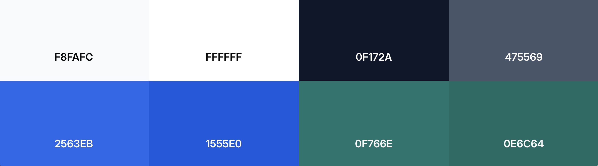

This palette was chosen to communicate several important qualities:
- Trust and stability through deep blues.
- Authority and professionalism through dark text tones.
- Innovation and modern technology through teal accents.
- Clarity and accessibility through light backgrounds and strong contrast.

The combination of these colours ensures that the interface remains minimal, professional and easy to read, while also aligning with the visual language commonly used in modern technology products.

### Typography

## Wireframes

To follow best practice, wireframes were developed for mobile, tablet, and desktop sizes.
I've used [Balsamiq](https://balsamiq.com/wireframes) to design my site wireframes.

| Page | Mobile | Tablet | Desktop |
| --- | --- | --- | --- |
| Sign Up | 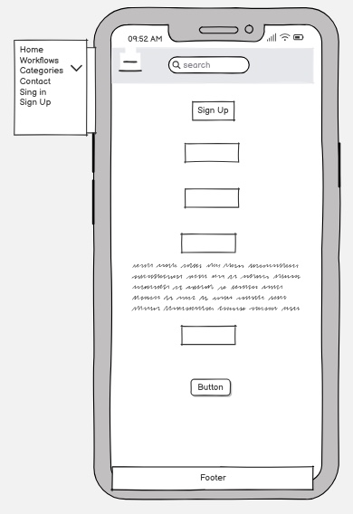 | 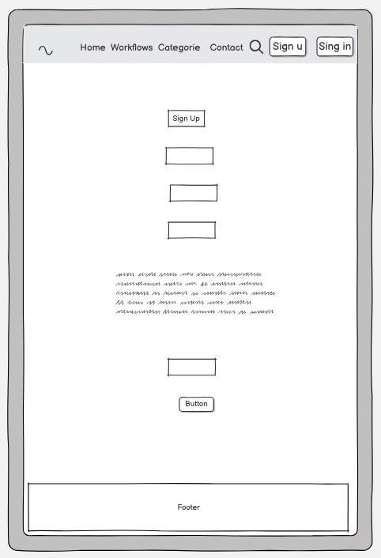 | 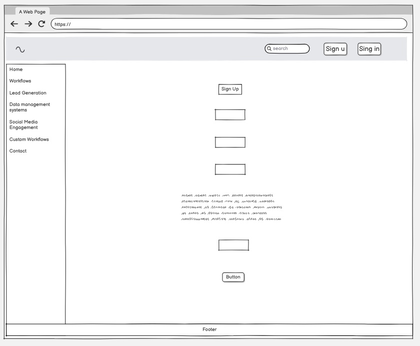 |
| Login | 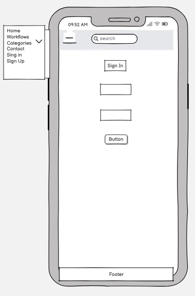 | 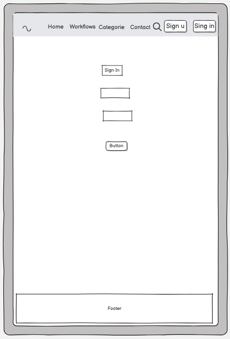 | 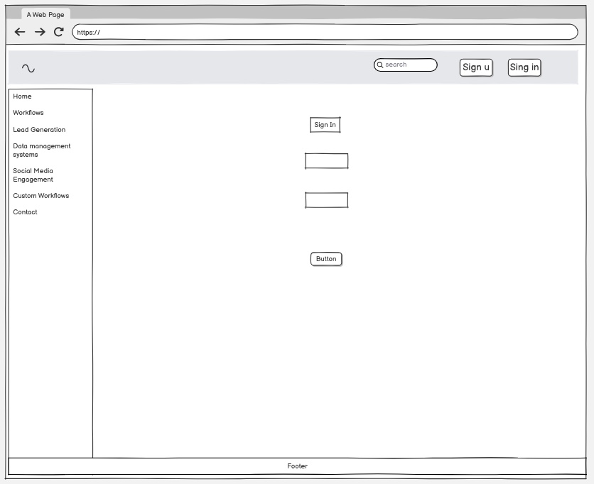 |
| Home | 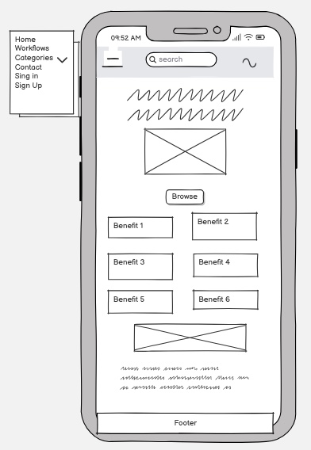 | 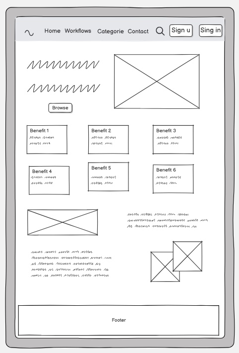 | 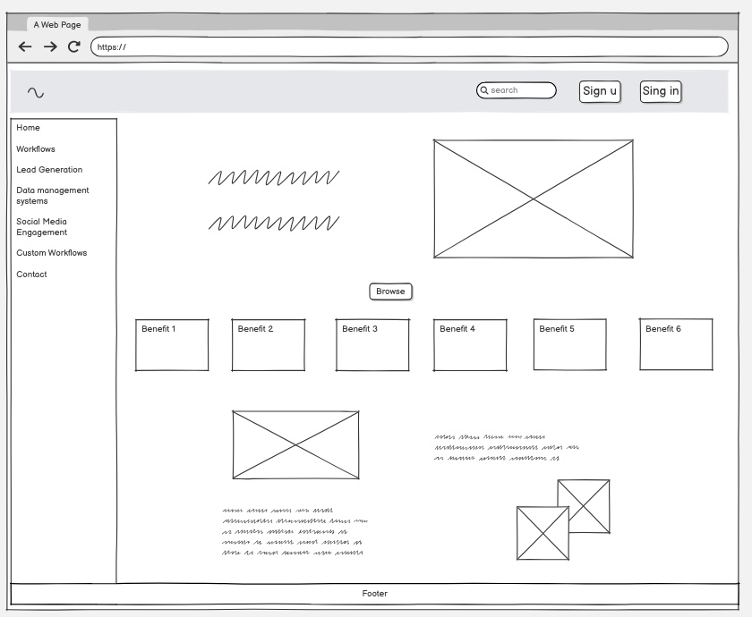 |
| Workflows| 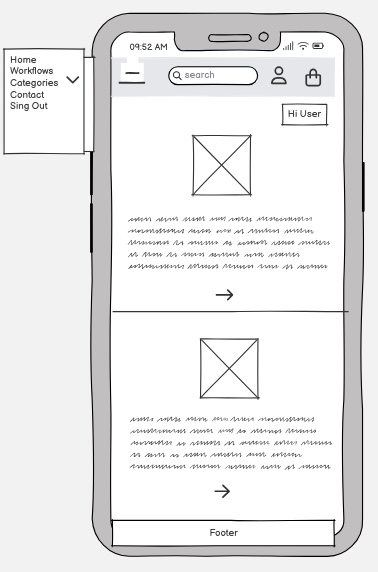 | 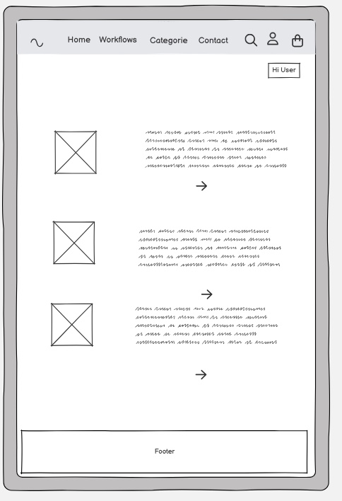 | 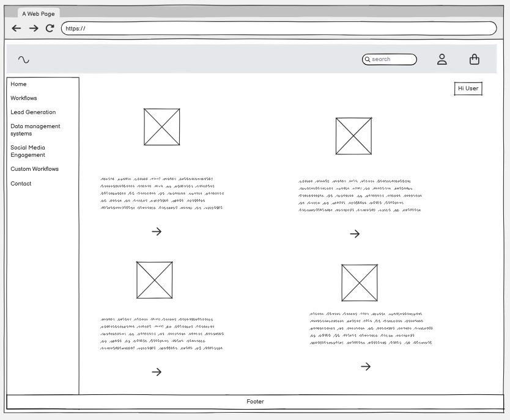 |
| Workflow detail | 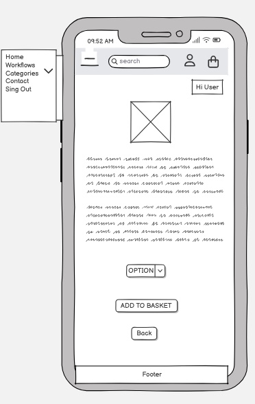 | 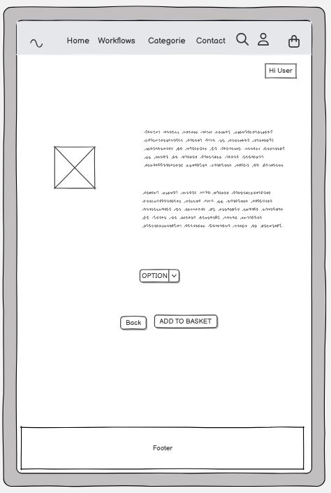 | 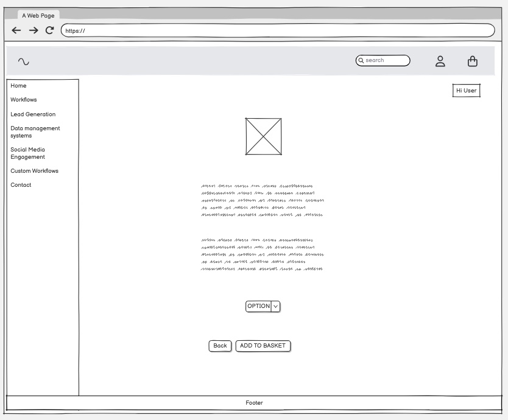 |
| Shopping bag | 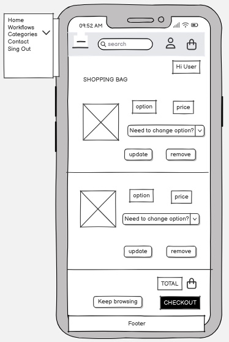 | 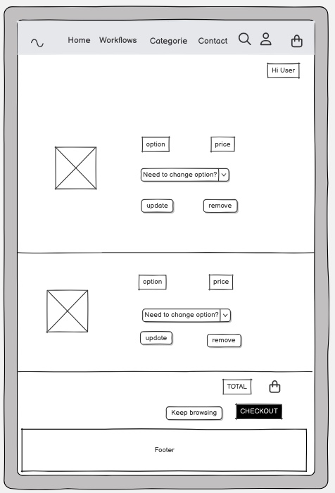 | 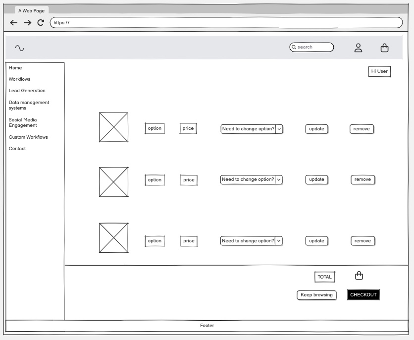 |
| Checkout | 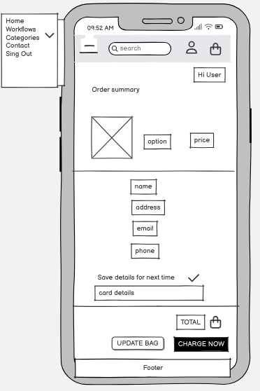 | 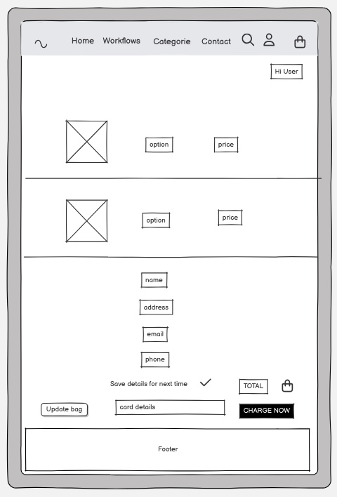 | 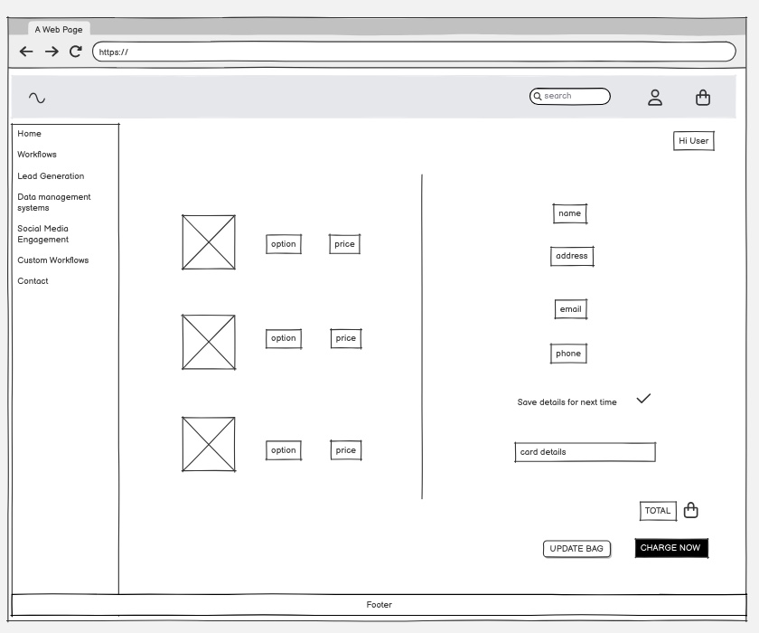 |
| Success page | 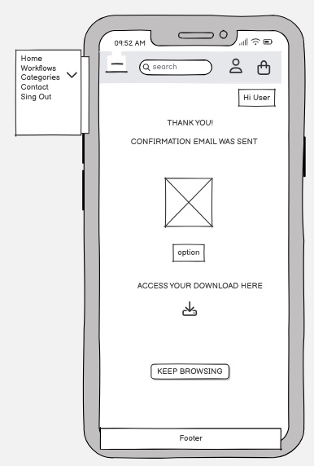 | 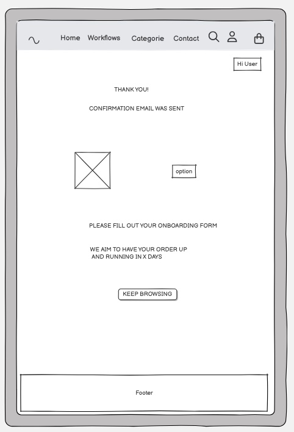 | 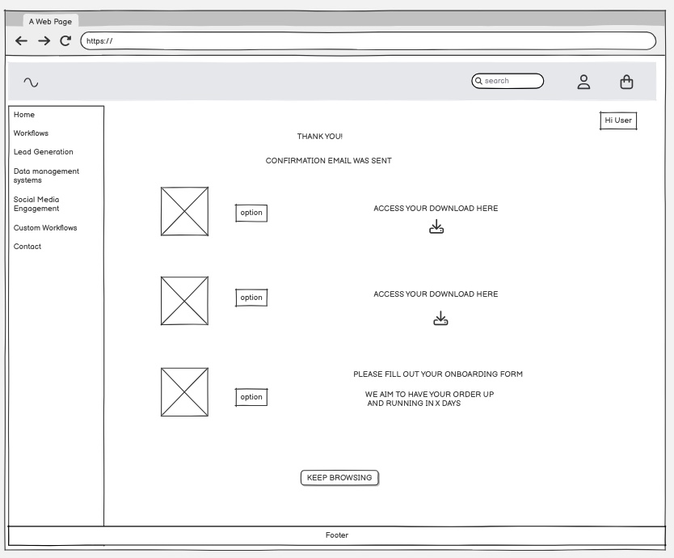 |
| 404 |  |  |  |
