# Testing

> [!NOTE]  
> Return back to the [README.md](README.md) file.

## Code Validation

### HTML

I have used the recommended [HTML W3C Validator](https://validator.w3.org) to validate all of my HTML files.

| Directory | File | URL | Screenshot | Notes |
| --- | --- | --- | --- | --- |
| home/templates/home | [index.html](https://github.com/Karla-Stein/opsiflow/blob/main/home/templates/home/index.html) | [HTML Validator](https://validator.w3.org/nu/?doc=https%3A%2F%2Fopsiflow-952bb478dd9c.herokuapp.com%2F#textarea) |  | Homepage does not require log-in, hence validated via URL |
| products/templates/products| [products.html](https://github.com/Karla-Stein/opsiflow/blob/main/products/templates/products/products.html) |[HTML Validator](https://validator.w3.org/nu/?doc=https%3A%2F%2Fopsiflow-952bb478dd9c.herokuapp.com%2Fproducts%2F#textarea) | 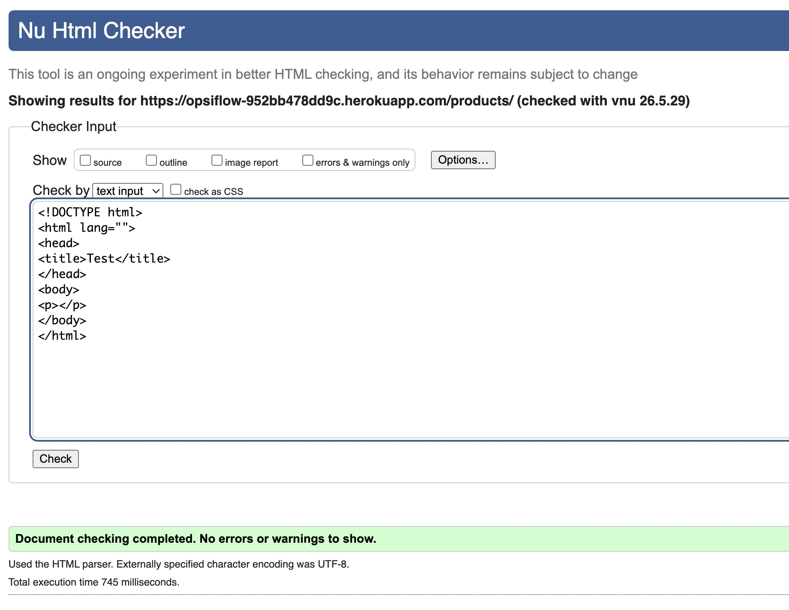 | Products page does not require log-in, hence validated via URL |
| products/templates/products| [product_detail.html](https://github.com/Karla-Stein/opsiflow/blob/main/products/templates/products/product_detail.html) | [HTML Validator](https://validator.w3.org/nu/?doc=https%3A%2F%2Fopsiflow-952bb478dd9c.herokuapp.com%2Fproducts%2Fproduct_detail%2F4#textarea) | 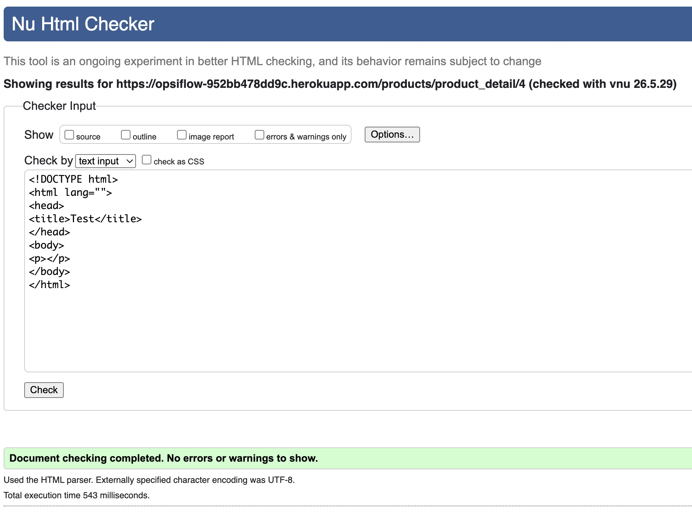 | Product details does not require log-in, hence validated via URL |
| templates/allauth/account| [login.html](https://github.com/Karla-Stein/opsiflow/blob/main/templates/allauth/account/login.html) | [HTML Validator](https://validator.w3.org/nu/?doc=https%3A%2F%2Fopsiflow-952bb478dd9c.herokuapp.com%2Faccounts%2Flogin%2F%3Fnext%3D%2Fproducts%2Fproduct_detail%2F4#textarea) | 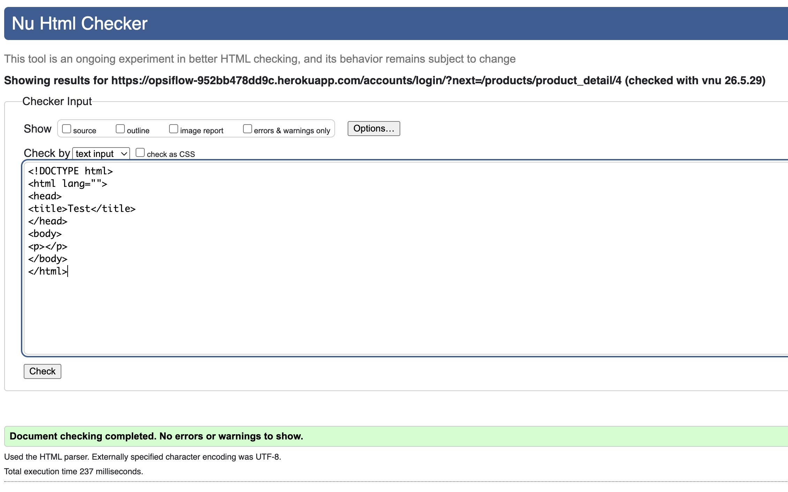 | Log in page does not require log-in, hence validated via URL |
| templates/allauth/account | [signup.html](https://github.com/Karla-Stein/opsiflow/blob/main/templates/allauth/account/signup.html) |  [HTML Validator](https://validator.w3.org/nu/?doc=https%3A%2F%2Fopsiflow-952bb478dd9c.herokuapp.com%2Faccounts%2Fsignup%2F#textarea) | 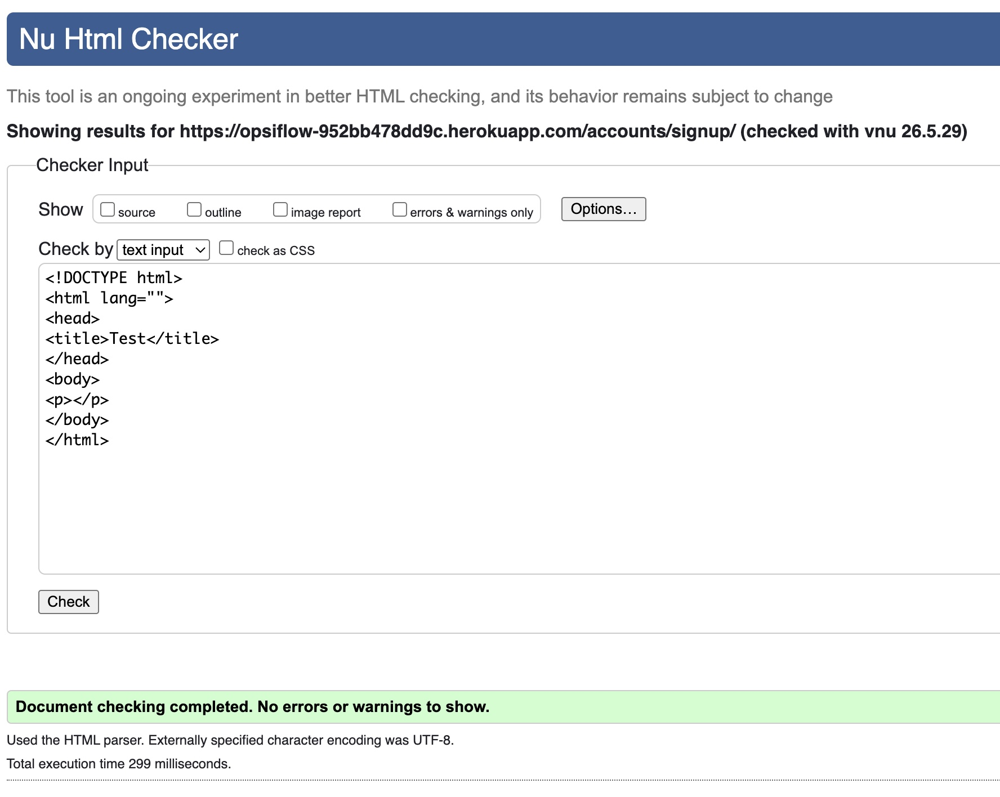 | Sign up page does not require log-in, hence validated via URL |
| bag/templates/bag | [bag.html](https://github.com/Karla-Stein/opsiflow/blob/main/bag/templates/bag/bag.html) |  | 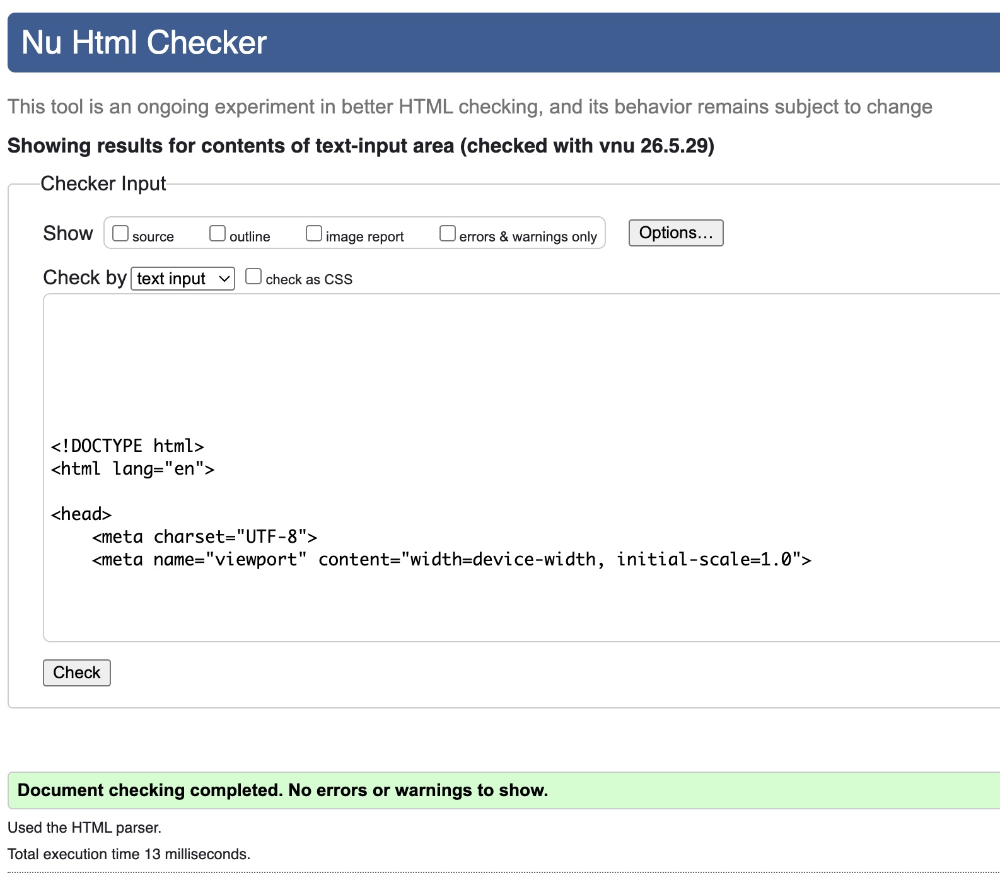 | Log in required, hence validated by input. |
| checkout/templates/checkout | [checkout.html](https://github.com/Karla-Stein/opsiflow/blob/main/checkout/templates/checkout/checkout.html) |  | 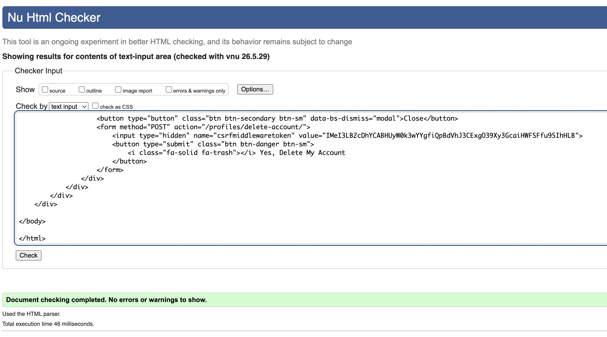 | Log in required, hence validated by input. |
| checkout/templates/checkout  | [checkout_success.html](https://github.com/Karla-Stein/opsiflow/blob/main/checkout/templates/checkout/checkout_success.html) |  | 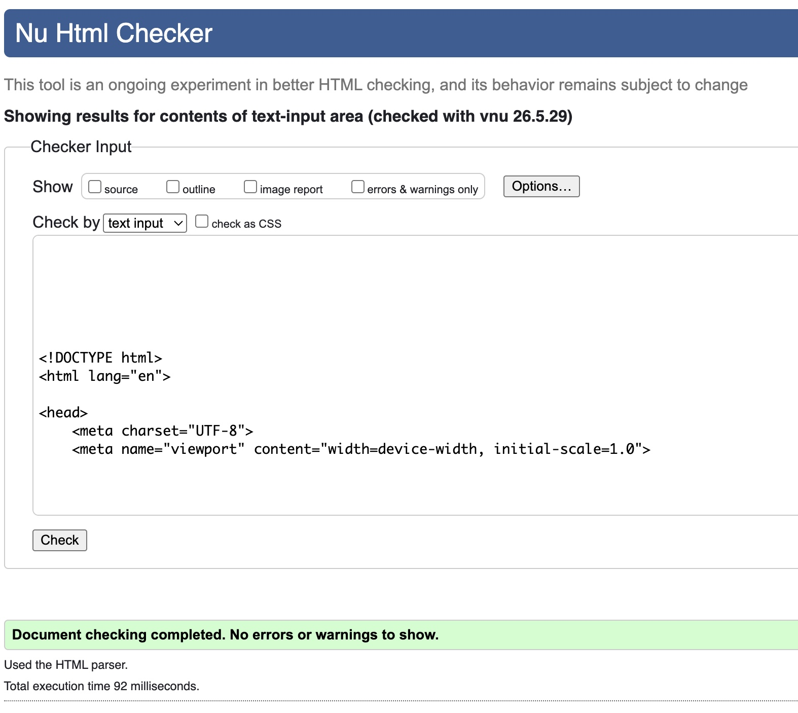 |Log in required, hence validated by input. |
| profiles/templates/profiles | [purchases.html](https://github.com/Karla-Stein/opsiflow/blob/main/profiles/templates/profiles/purchases.html) |  | 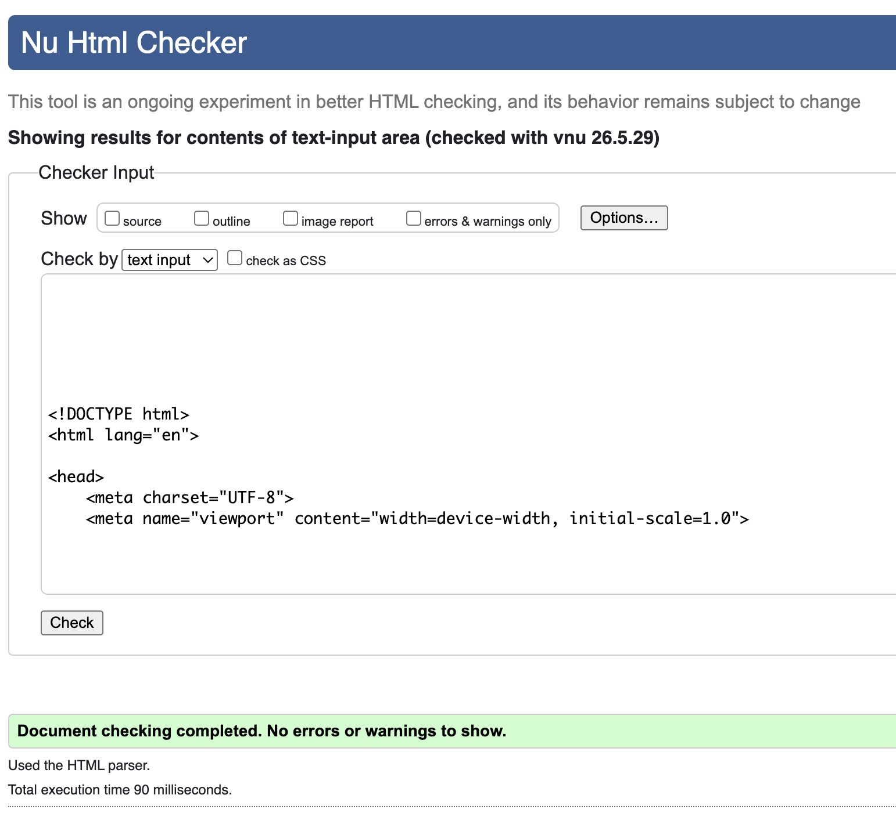 |Log in required, hence validated by input. |
| profiles/templates/profiles | [profile.html](https://github.com/Karla-Stein/opsiflow/blob/main/profiles/templates/profiles/profile.html) |  | 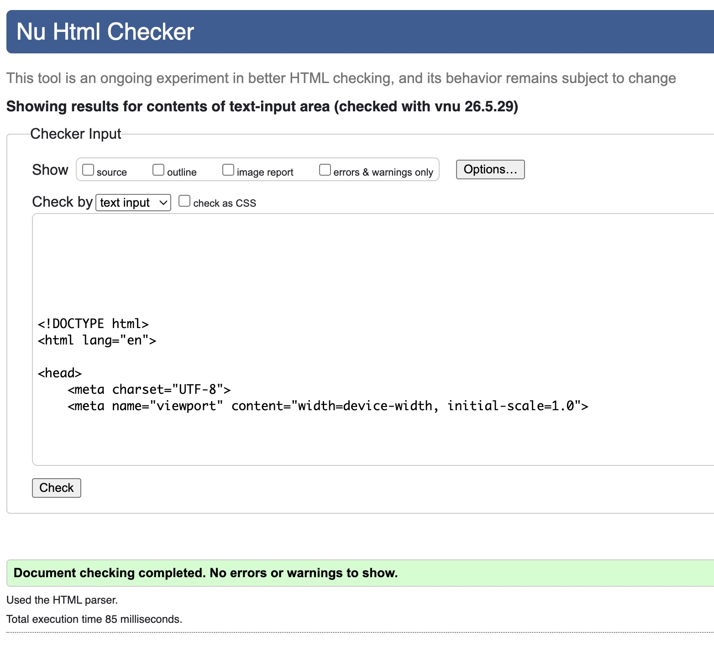 | Log in required, hence validated by input. |
| templates/allauth/account| [logout.html](https://github.com/Karla-Stein/opsiflow/blob/main/templates/allauth/account/logout.html) |  |  |Log in required, hence validated by input. |
| checkout/templates/checkout/email | [purchase_confirmation.html](https://github.com/Karla-Stein/opsiflow/blob/main/checkout/templates/checkout/emails/purchase_confirmation.html) |  | 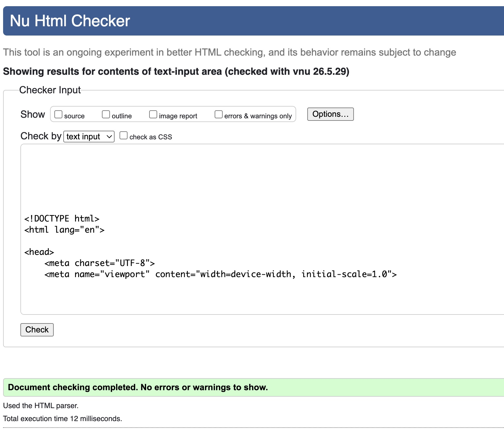 | The email template was rendered locally and validated by direct input. |
| templates | [404.html](https://github.com/Karla-Stein/opsiflow/blob/main/templates/404.html) | [HTML Validator](https://validator.w3.org/nu/?doc=https%3A%2F%2Fopsiflow-952bb478dd9c.herokuapp.com%2F404&checkerrorpages=yes#textarea )| 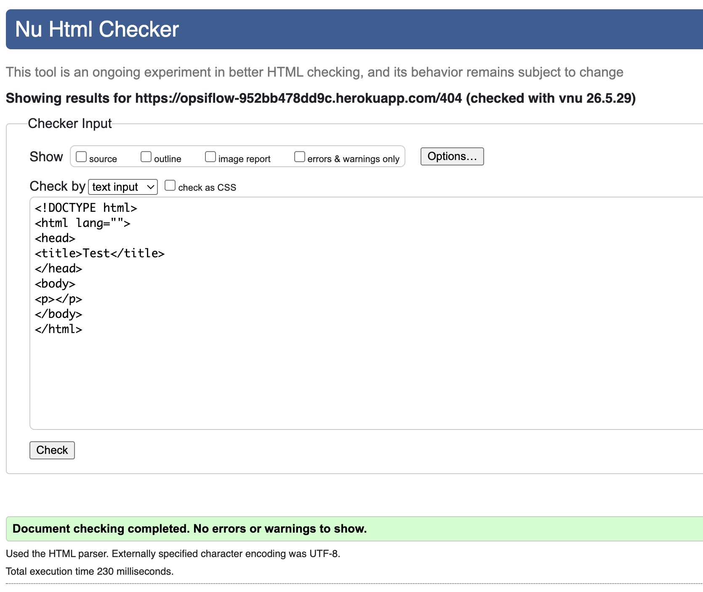 | 404 page does not require log-in, hence validated via URL |

### CSS

I have used the recommended [CSS Jigsaw Validator](https://jigsaw.w3.org/css-validator) to validate all of my CSS files.

| Directory | File | URL | Screenshot | Notes |
| --- | --- | --- | --- | --- |
| checkout | [checkout.css](https://github.com/Karla-Stein/opsiflow/blob/main/checkout/static/checkout/css/checkout.css) | [CSS Validator](https://jigsaw.w3.org/css-validator/validator?uri=+https%3A%2F%2Fopsiflow.s3.amazonaws.com%2Fstatic%2Fcheckout%2Fcss%2Fcheckout.css&profile=css3svg&usermedium=all&warning=1&vextwarning=&lang=en) | 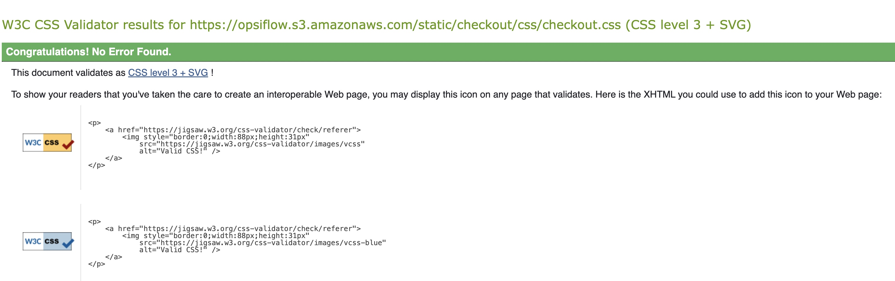 | Passed with 0 errors and 0 warnings. |
| products | [product_detail.css](https://github.com/Karla-Stein/opsiflow/blob/main/products/static/products/css/product_detail.css) | [CSS Validator](https://jigsaw.w3.org/css-validator/validator?uri=https%3A%2F%2Fopsiflow.s3.amazonaws.com%2Fstatic%2Fproducts%2Fcss%2Fproduct_detail.css&profile=css3svg&usermedium=all&warning=1&vextwarning=&lang=en) | 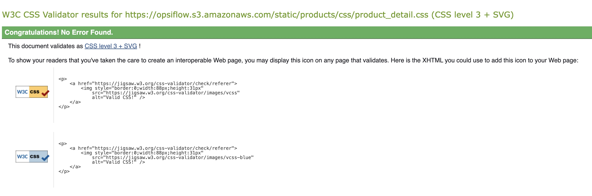 |  Passed with 0 errors. The validator reported 4 warnings relating to CSS custom variables, which are expected and do not affect functionality. |
| products | [products.css](https://github.com/Karla-Stein/opsiflow/blob/main/products/static/products/css/products.css) | [CSS Validator](https://jigsaw.w3.org/css-validator/validator?uri=+https%3A%2F%2Fopsiflow.s3.amazonaws.com%2Fstatic%2Fproducts%2Fcss%2Fproducts.css&profile=css3svg&usermedium=all&warning=1&vextwarning=&lang=en) | 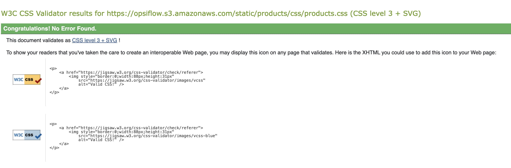 |  Passed with 0 errors and 0 warnings. |
| profiles | [profiles.css](https://github.com/Karla-Stein/opsiflow/blob/main/profiles/static/profiles/css/profiles.css) | [CSS Validator](https://jigsaw.w3.org/css-validator/validator?uri=https%3A%2F%2Fopsiflow.s3.amazonaws.com%2Fstatic%2Fprofiles%2Fcss%2Fprofiles.css&profile=css3svg&usermedium=all&warning=1&vextwarning=&lang=en) | 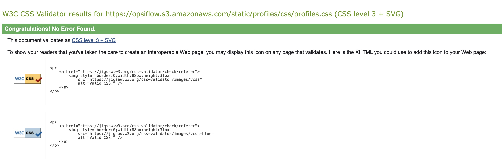 | Passed with 0 errors. The validator reported 1 warning relating to CSS custom variables, which are expected and do not affect functionality. |
| static | [base.css](https://github.com/Karla-Stein/opsiflow/blob/main/static/css/base.css) | [CSS Validator](https://jigsaw.w3.org/css-validator/validator?uri=https%3A%2F%2Fopsiflow.s3.amazonaws.com%2Fstatic%2Fcss%2Fbase.css&profile=css3svg&usermedium=all&warning=1&vextwarning=&lang=en) | 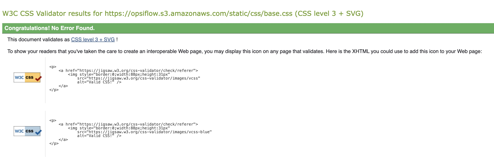 | Passed with 0 errors. The validator reported 23 warnings relating to CSS custom variables, which are expected and do not affect functionality. |

### Javascript

I have used the recommended [JShint Validator](https://jshint.com) to validate all of my JS files.

| Directory | File | Screenshot | Notes |
| --- | --- | --- | --- |
| checkout | [stripe.js](https://github.com/Karla-Stein/opsiflow/blob/main/checkout/static/checkout/js/stripe.js) | 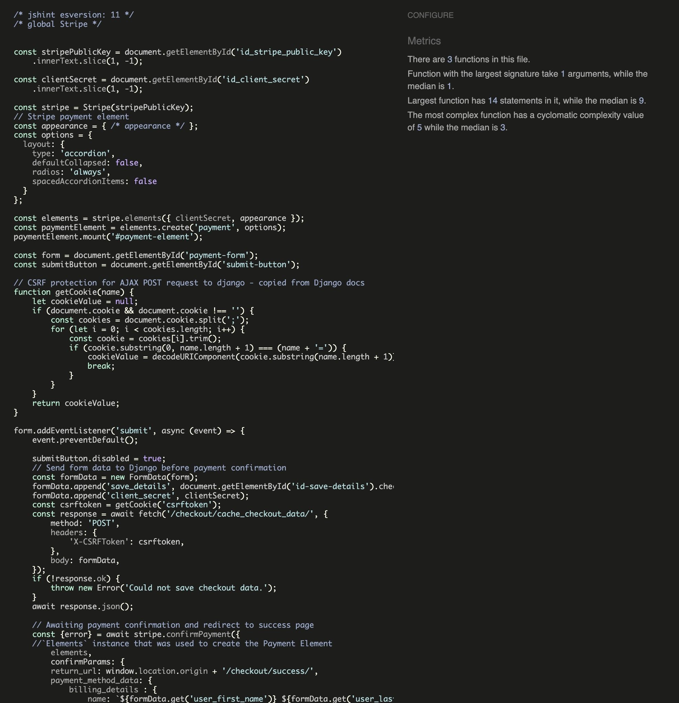 |  |
| products | [product_details.js](https://github.com/Karla-Stein/opsiflow/blob/main/products/static/products/js/product_details.js) | 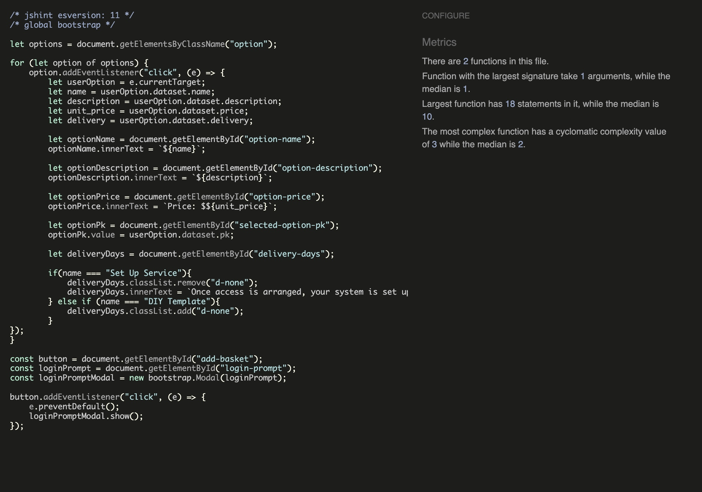 |  |
| bag | [bag.html](https://github.com/Karla-Stein/opsiflow/blob/main/bag/templates/bag/bag.html) | 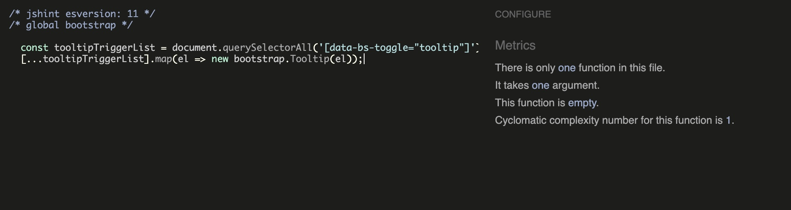 | Embedded JavaScript snippet located in the postloadjs block. JSHint validation performed using ES11 and Bootstrap global configuration. |
| products | [products.html](https://github.com/Karla-Stein/opsiflow/blob/main/products/templates/products/products.html) | 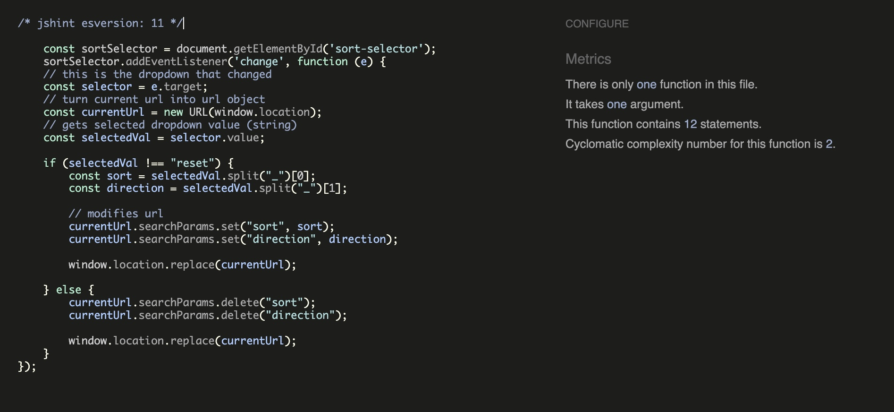 |  Embedded JavaScript snippet located in the postloadjs block. JSHint validation performed using ES11 configuration. |
| templates | [base.html](https://github.com/Karla-Stein/opsiflow/blob/main/templates/base.html)| 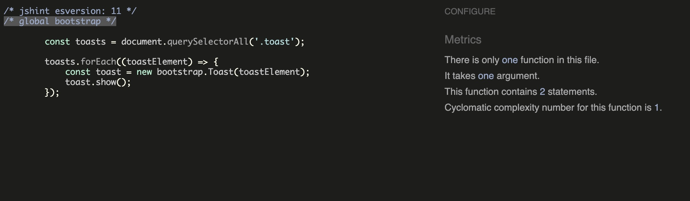 |  Embedded JavaScript snippet located in the postloadjs block. JSHint validation performed using ES11 and Bootstrap global configuration. |

### Python

I have used the recommended [PEP8 CI Python Linter](https://pep8ci.herokuapp.com) to validate all of my Python files.

| Directory | File | URL | Screenshot | 
| --- | --- | --- | --- | 
| bag | [contexts.py](https://github.com/Karla-Stein/opsiflow/blob/main/bag/contexts.py) | [PEP8 CI Link](https://pep8ci.herokuapp.com/https://raw.githubusercontent.com/Karla-Stein/opsiflow/refs/heads/main/bag/contexts.py) | 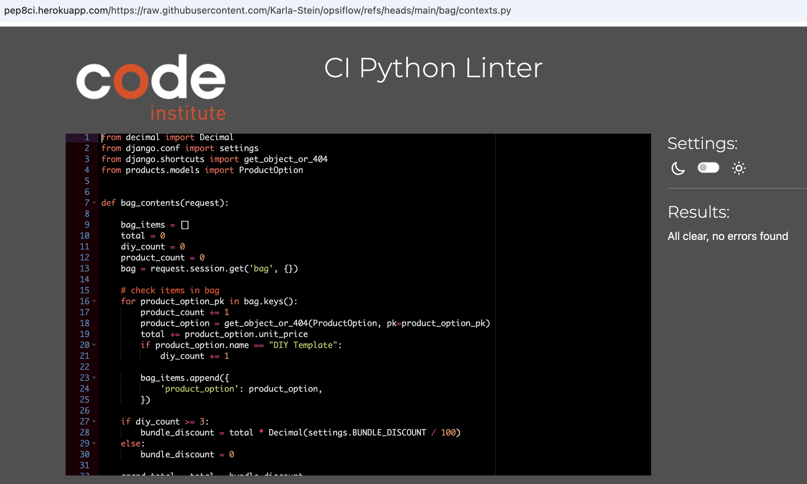 | 
| bag | [test_views.py](https://github.com/Karla-Stein/opsiflow/blob/main/bag/test_views.py) | [PEP8 CI Link](https://pep8ci.herokuapp.com/https://raw.githubusercontent.com/Karla-Stein/opsiflow/refs/heads/main/bag/test_views.py) | 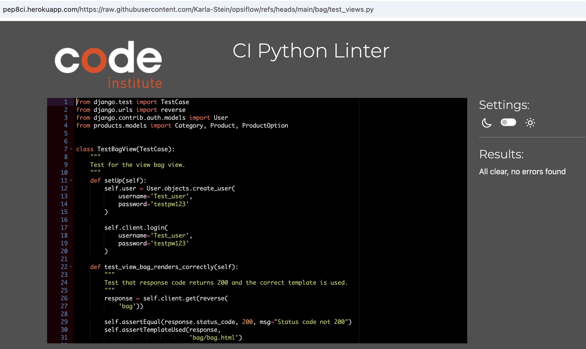 |  
| bag | [urls.py](https://github.com/Karla-Stein/opsiflow/blob/main/bag/urls.py) | [PEP8 CI Link](https://pep8ci.herokuapp.com/https://raw.githubusercontent.com/Karla-Stein/opsiflow/refs/heads/main/bag/urls.py) | 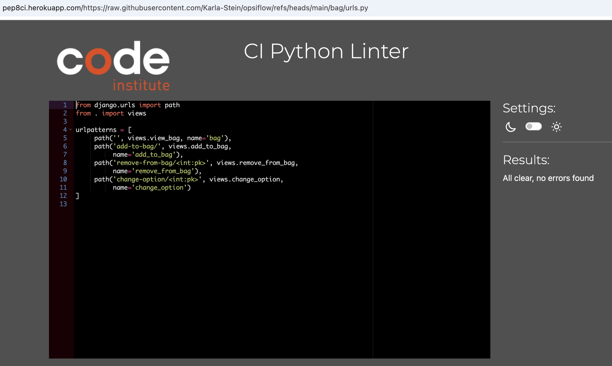 |  
| bag | [views.py](https://github.com/Karla-Stein/opsiflow/blob/main/bag/views.py) | [PEP8 CI Link](https://pep8ci.herokuapp.com/https://raw.githubusercontent.com/Karla-Stein/opsiflow/refs/heads/main/bag/views.py) | 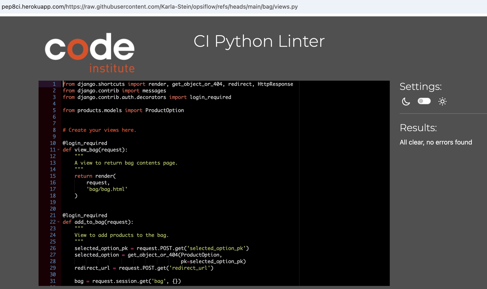 | 
| checkout | [admin.py](https://github.com/Karla-Stein/opsiflow/blob/main/checkout/admin.py) | [PEP8 CI Link](https://pep8ci.herokuapp.com/https://raw.githubusercontent.com/Karla-Stein/opsiflow/refs/heads/main/checkout/admin.py) | 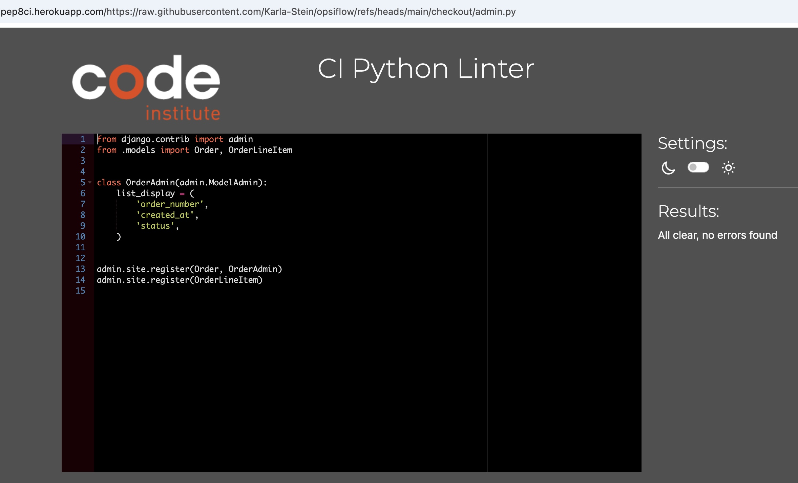 | 
| checkout | [forms.py](https://github.com/Karla-Stein/opsiflow/blob/main/checkout/forms.py) | [PEP8 CI Link](https://pep8ci.herokuapp.com/https://raw.githubusercontent.com/Karla-Stein/opsiflow/refs/heads/main/checkout/forms.py) | 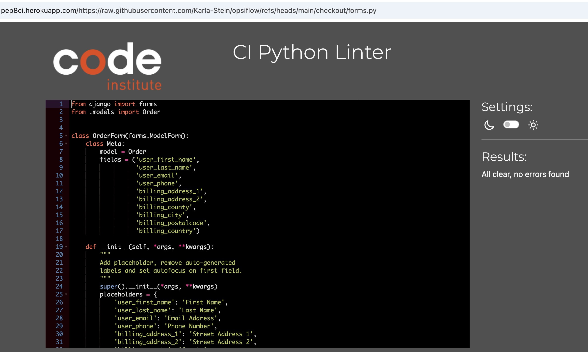 |  
| checkout | [models.py](https://github.com/Karla-Stein/opsiflow/blob/main/checkout/models.py) | [PEP8 CI Link](https://pep8ci.herokuapp.com/https://raw.githubusercontent.com/Karla-Stein/opsiflow/refs/heads/main/checkout/models.py) | 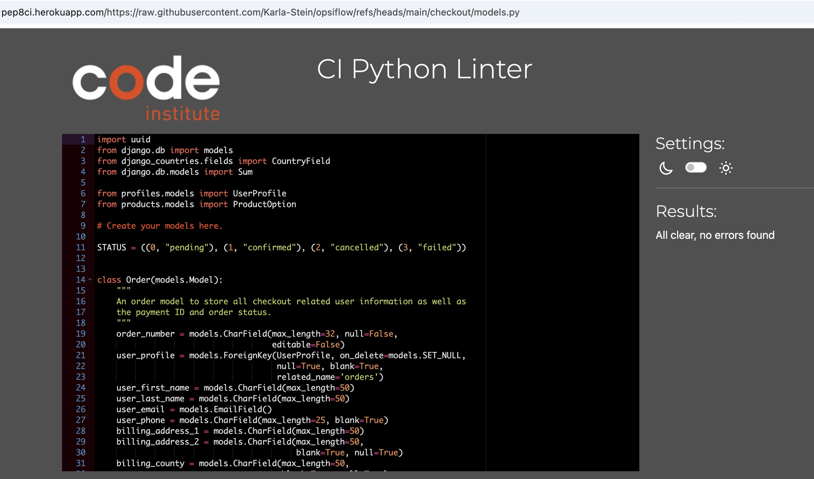 | 
| checkout | [test_forms.py](https://github.com/Karla-Stein/opsiflow/blob/main/checkout/test_forms.py) | [PEP8 CI Link](https://pep8ci.herokuapp.com/https://raw.githubusercontent.com/Karla-Stein/opsiflow/refs/heads/main/checkout/test_forms.py) | 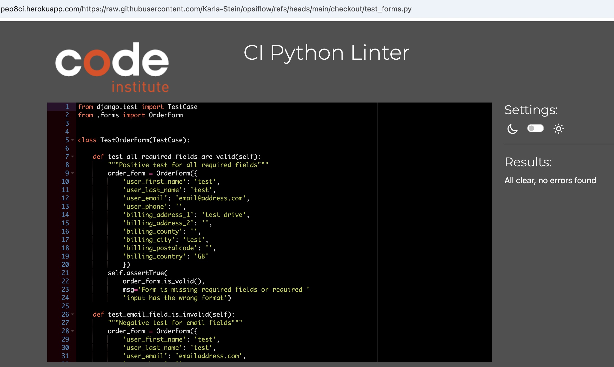 | 
| checkout | [test_models.py](https://github.com/Karla-Stein/opsiflow/blob/main/checkout/test_models.py) | [PEP8 CI Link](https://pep8ci.herokuapp.com/https://raw.githubusercontent.com/Karla-Stein/opsiflow/refs/heads/main/checkout/test_models.py) | 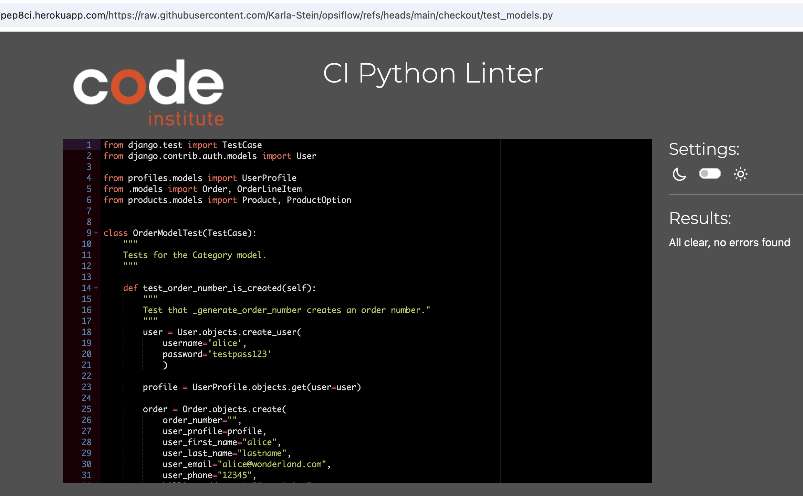 |  
| checkout | [test_views.py](https://github.com/Karla-Stein/opsiflow/blob/main/checkout/test_views.py) | [PEP8 CI Link](https://pep8ci.herokuapp.com/https://raw.githubusercontent.com/Karla-Stein/opsiflow/refs/heads/main/checkout/test_views.py) | 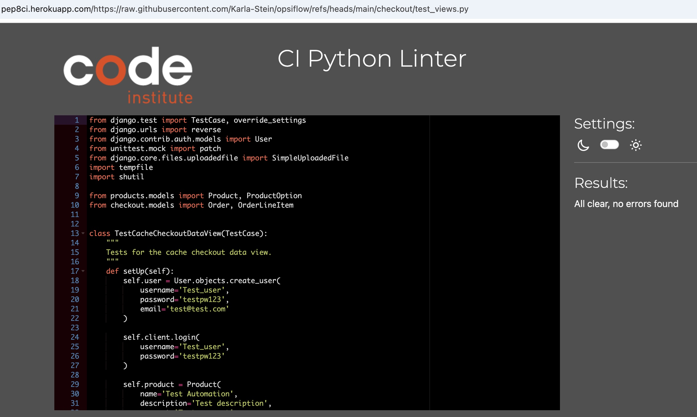 | 
| checkout | [test_webhooks.py](https://github.com/Karla-Stein/opsiflow/blob/main/checkout/test_webhooks.py) | [PEP8 CI Link](https://pep8ci.herokuapp.com/https://raw.githubusercontent.com/Karla-Stein/opsiflow/refs/heads/main/checkout/test_webhooks.py) | 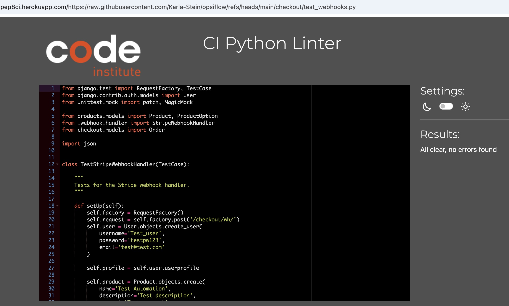 |  
| checkout | [urls.py](https://github.com/Karla-Stein/opsiflow/blob/main/checkout/urls.py) | [PEP8 CI Link](https://pep8ci.herokuapp.com/https://raw.githubusercontent.com/Karla-Stein/opsiflow/refs/heads/main/checkout/urls.py) | 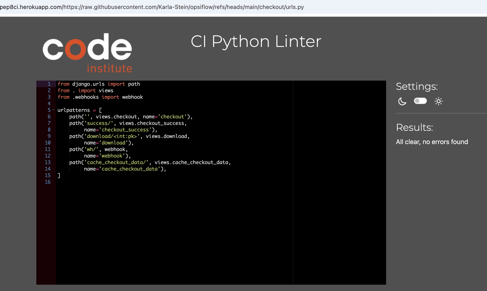 |  
| checkout | [views.py](https://github.com/Karla-Stein/opsiflow/blob/main/checkout/views.py) | [PEP8 CI Link](https://pep8ci.herokuapp.com/https://raw.githubusercontent.com/Karla-Stein/opsiflow/refs/heads/main/checkout/views.py) | 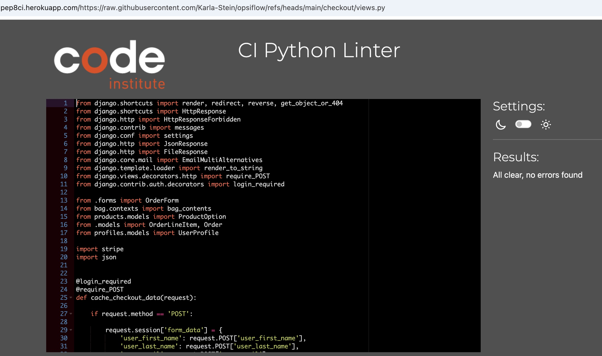 | 
| checkout | [webhook_handler.py](https://github.com/Karla-Stein/opsiflow/blob/main/checkout/webhook_handler.py) | [PEP8 CI Link](https://pep8ci.herokuapp.com/https://raw.githubusercontent.com/Karla-Stein/opsiflow/refs/heads/main/checkout/webhook_handler.py) | 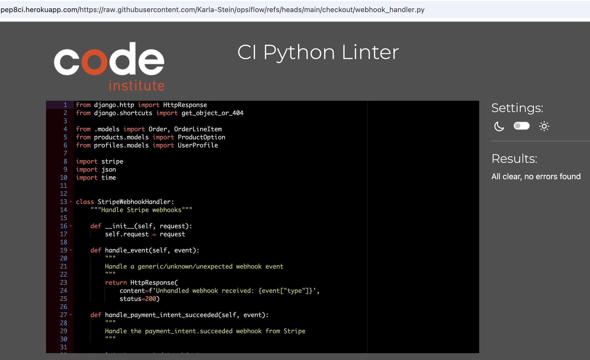 | 
| checkout | [webhooks.py](https://github.com/Karla-Stein/opsiflow/blob/main/checkout/webhooks.py) | [PEP8 CI Link](https://pep8ci.herokuapp.com/https://raw.githubusercontent.com/Karla-Stein/opsiflow/refs/heads/main/checkout/webhooks.py) | 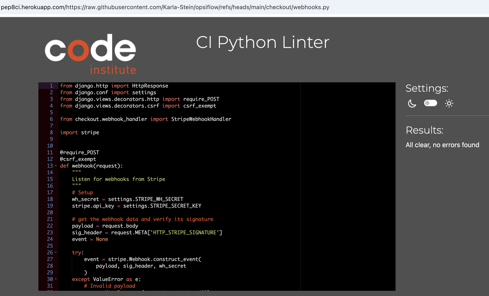 | 
| home | [test_views.py](https://github.com/Karla-Stein/opsiflow/blob/main/home/test_views.py) | [PEP8 CI Link](https://pep8ci.herokuapp.com/https://raw.githubusercontent.com/Karla-Stein/opsiflow/refs/heads/main/home/test_views.py) | 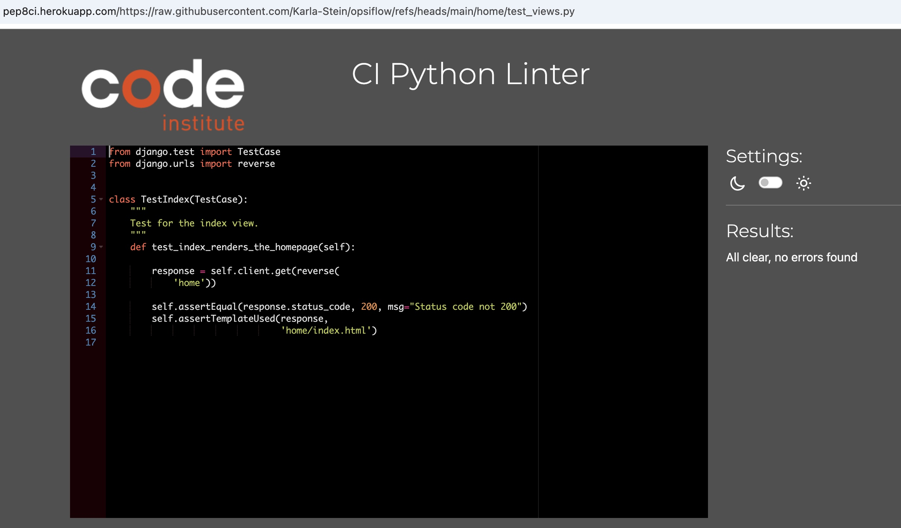 |  
| home | [urls.py](https://github.com/Karla-Stein/opsiflow/blob/main/home/urls.py) | [PEP8 CI Link](https://pep8ci.herokuapp.com/https://raw.githubusercontent.com/Karla-Stein/opsiflow/refs/heads/main/home/urls.py) | 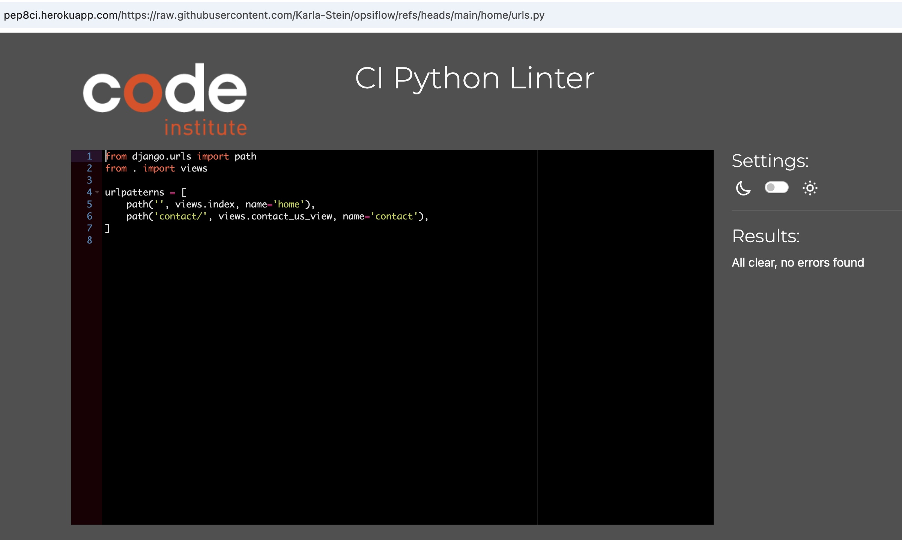 | 
| home | [views.py](https://github.com/Karla-Stein/opsiflow/blob/main/home/views.py) | [PEP8 CI Link](https://pep8ci.herokuapp.com/https://raw.githubusercontent.com/Karla-Stein/opsiflow/refs/heads/main/home/views.py) | 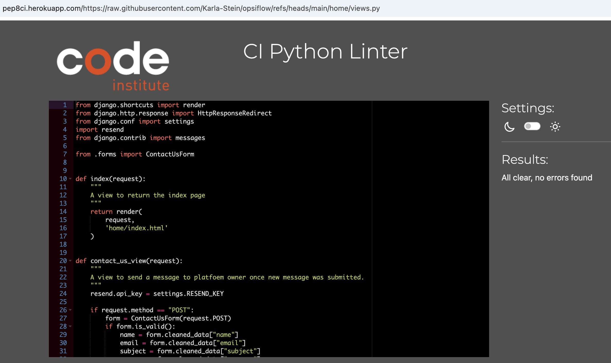 |  
| opsiflow | [settings.py](https://github.com/Karla-Stein/opsiflow/blob/main/opsiflow/settings.py) | [PEP8 CI Link](https://pep8ci.herokuapp.com/https://raw.githubusercontent.com/Karla-Stein/opsiflow/refs/heads/main/opsiflow/settings.py) | 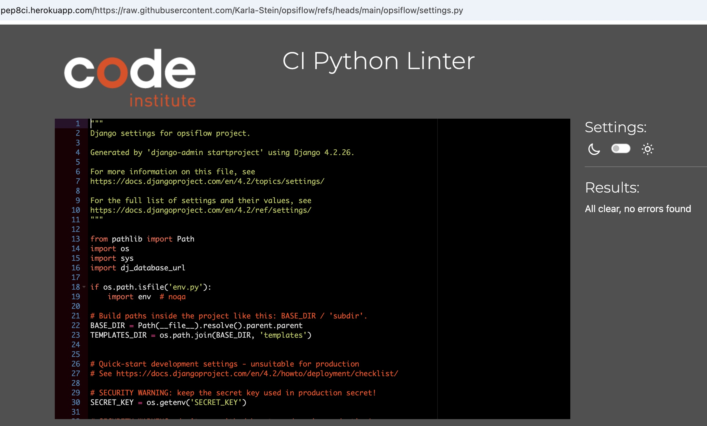 |  
| opsiflow | [urls.py](https://github.com/Karla-Stein/opsiflow/blob/main/opsiflow/urls.py) | [PEP8 CI Link](https://pep8ci.herokuapp.com/https://raw.githubusercontent.com/Karla-Stein/opsiflow/refs/heads/main/opsiflow/urls.py) | 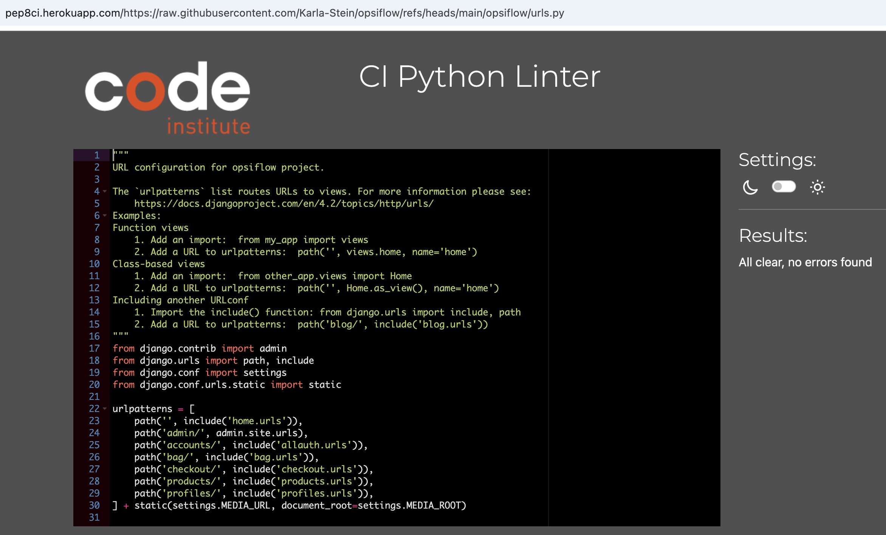 |  
| products | [admin.py](https://github.com/Karla-Stein/opsiflow/blob/main/products/admin.py) | [PEP8 CI Link](https://pep8ci.herokuapp.com/https://raw.githubusercontent.com/Karla-Stein/opsiflow/refs/heads/main/products/admin.py) | 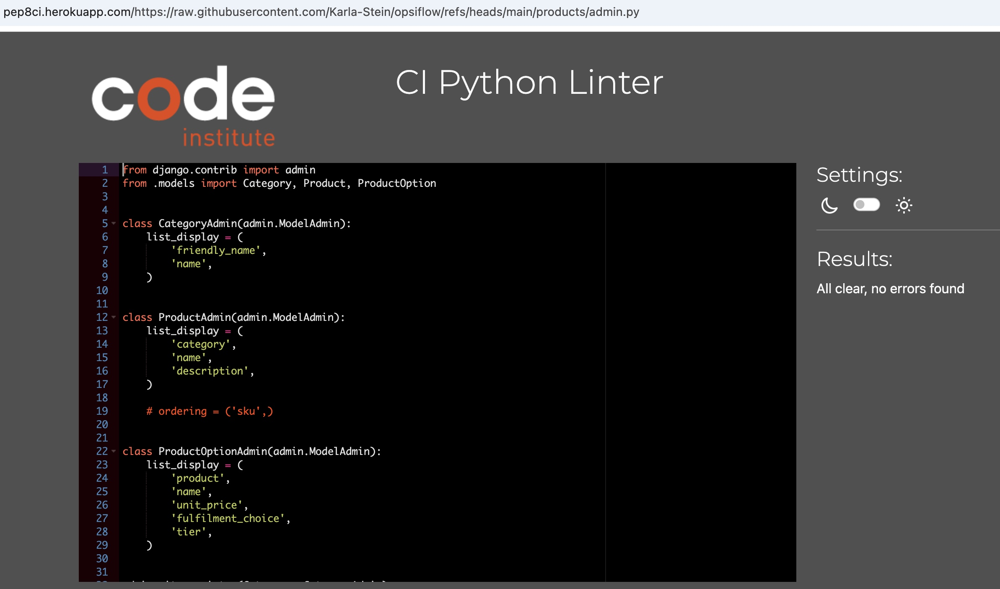 | 
| products | [models.py](https://github.com/Karla-Stein/opsiflow/blob/main/products/models.py) | [PEP8 CI Link](https://pep8ci.herokuapp.com/https://raw.githubusercontent.com/Karla-Stein/opsiflow/refs/heads/main/products/models.py) | 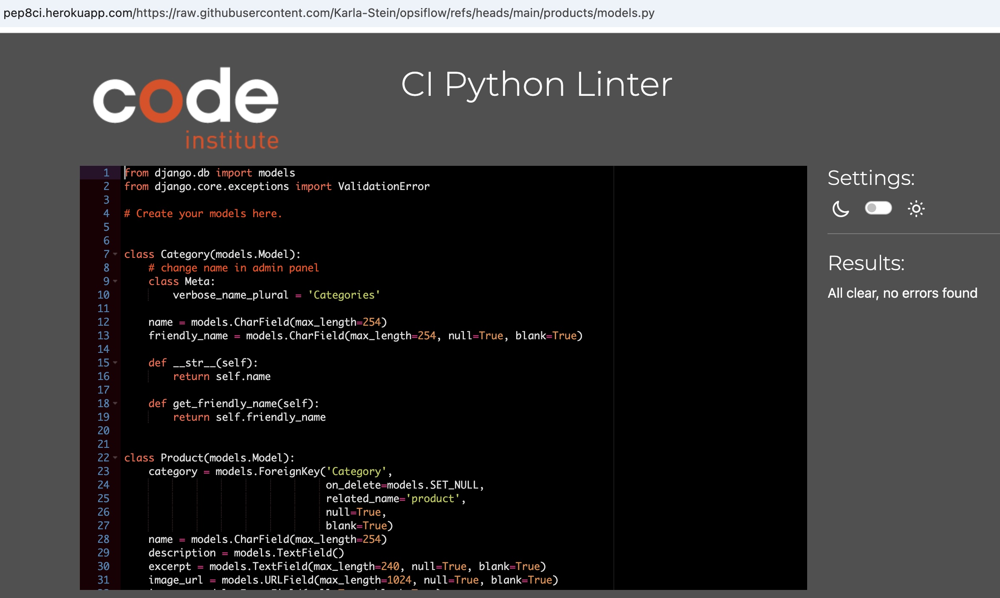 | 
| products | [test_models.py](https://github.com/Karla-Stein/opsiflow/blob/main/products/test_models.py) | [PEP8 CI Link](https://pep8ci.herokuapp.com/https://raw.githubusercontent.com/Karla-Stein/opsiflow/refs/heads/main/products/test_models.py) | 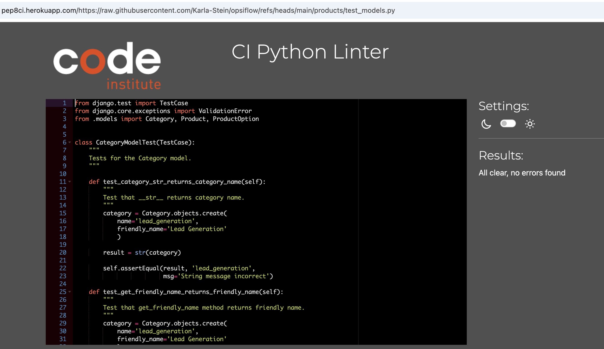 | 
| products | [test_views.py](https://github.com/Karla-Stein/opsiflow/blob/main/products/test_views.py) | [PEP8 CI Link](https://pep8ci.herokuapp.com/https://raw.githubusercontent.com/Karla-Stein/opsiflow/refs/heads/main/products/test_views.py) | 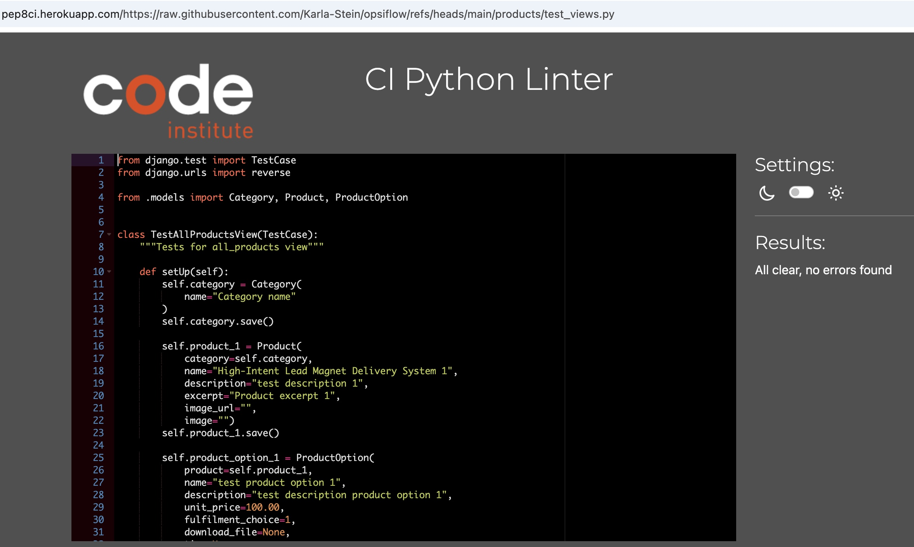 | 
| products | [urls.py](https://github.com/Karla-Stein/opsiflow/blob/main/products/urls.py) | [PEP8 CI Link](https://pep8ci.herokuapp.com/https://raw.githubusercontent.com/Karla-Stein/opsiflow/refs/heads/main/products/urls.py) | 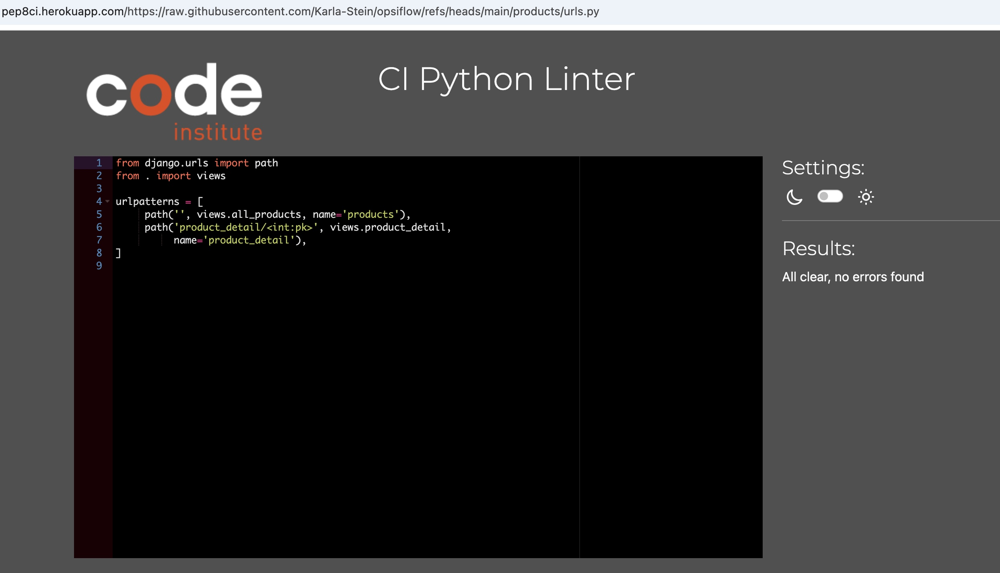 |  
| products | [views.py](https://github.com/Karla-Stein/opsiflow/blob/main/products/views.py) | [PEP8 CI Link](https://pep8ci.herokuapp.com/https://raw.githubusercontent.com/Karla-Stein/opsiflow/refs/heads/main/products/views.py) | 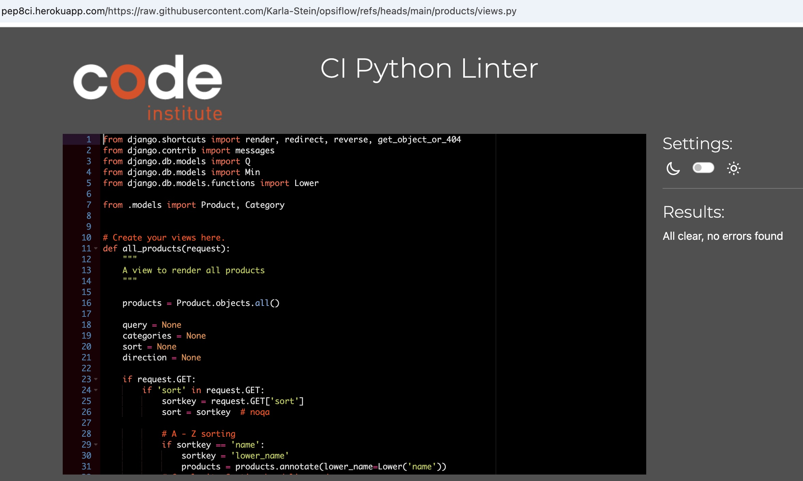 | 
| profiles | [admin.py](https://github.com/Karla-Stein/opsiflow/blob/main/profiles/admin.py) | [PEP8 CI Link](https://pep8ci.herokuapp.com/https://raw.githubusercontent.com/Karla-Stein/opsiflow/refs/heads/main/profiles/admin.py) | 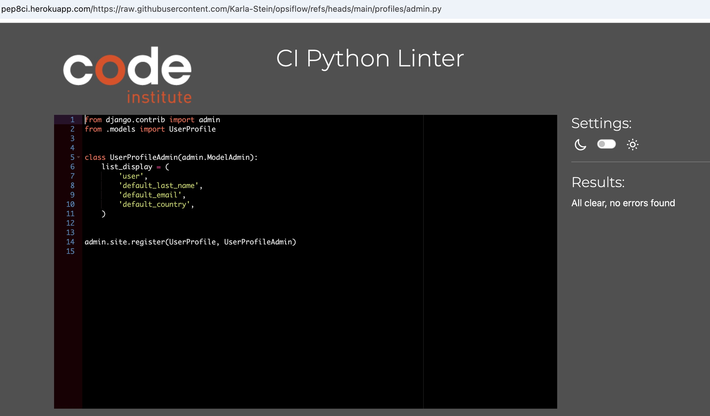 |  
| profiles | [forms.py](https://github.com/Karla-Stein/opsiflow/blob/main/profiles/forms.py) | [PEP8 CI Link](https://pep8ci.herokuapp.com/https://raw.githubusercontent.com/Karla-Stein/opsiflow/refs/heads/main/profiles/forms.py) | 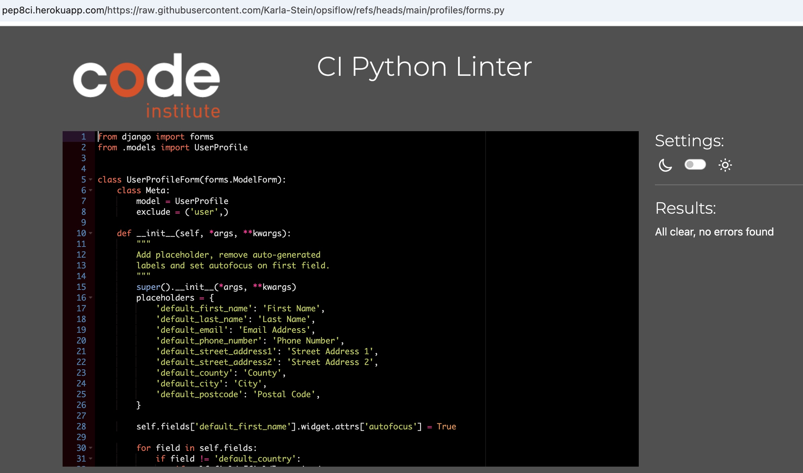 | 
| profiles | [models.py](https://github.com/Karla-Stein/opsiflow/blob/main/profiles/models.py) | [PEP8 CI Link](https://pep8ci.herokuapp.com/https://raw.githubusercontent.com/Karla-Stein/opsiflow/refs/heads/main/profiles/models.py) | 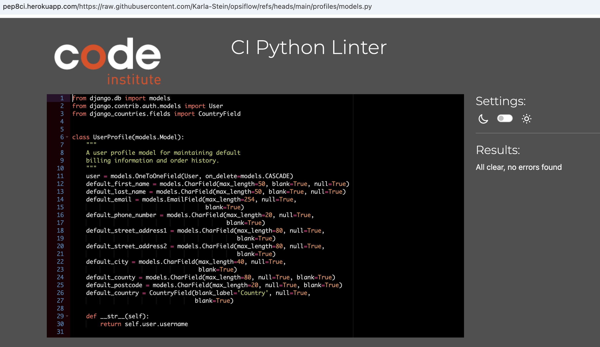 |  
| profiles | [signals.py](https://github.com/Karla-Stein/opsiflow/blob/main/profiles/signals.py) | [PEP8 CI Link](https://pep8ci.herokuapp.com/https://raw.githubusercontent.com/Karla-Stein/opsiflow/refs/heads/main/profiles/signals.py) |  |  
| profiles | [test_forms.py](https://github.com/Karla-Stein/opsiflow/blob/main/profiles/test_forms.py) | [PEP8 CI Link](https://pep8ci.herokuapp.com/https://raw.githubusercontent.com/Karla-Stein/opsiflow/refs/heads/main/profiles/test_forms.py) |  | 
| profiles | [test_models.py](https://github.com/Karla-Stein/opsiflow/blob/main/profiles/test_models.py) | [PEP8 CI Link](https://pep8ci.herokuapp.com/https://raw.githubusercontent.com/Karla-Stein/opsiflow/refs/heads/main/profiles/test_models.py) |  | 
| profiles | [test_views.py](https://github.com/Karla-Stein/opsiflow/blob/main/profiles/test_views.py) | [PEP8 CI Link](https://pep8ci.herokuapp.com/https://raw.githubusercontent.com/Karla-Stein/opsiflow/refs/heads/main/profiles/test_views.py) |  | 
| profiles | [urls.py](https://github.com/Karla-Stein/opsiflow/blob/main/profiles/urls.py) | [PEP8 CI Link](https://pep8ci.herokuapp.com/https://raw.githubusercontent.com/Karla-Stein/opsiflow/refs/heads/main/profiles/urls.py) |  |  
| profiles | [views.py](https://github.com/Karla-Stein/opsiflow/blob/main/profiles/views.py) | [PEP8 CI Link](https://pep8ci.herokuapp.com/https://raw.githubusercontent.com/Karla-Stein/opsiflow/refs/heads/main/profiles/views.py) |  | 
|  | [custom_storages.py](https://github.com/Karla-Stein/opsiflow/blob/main/custom_storages.py) | [PEP8 CI Link](https://pep8ci.herokuapp.com/https://raw.githubusercontent.com/Karla-Stein/opsiflow/refs/heads/main/custom_storages.py) |  | 
|  | [manage.py](https://github.com/Karla-Stein/opsiflow/blob/main/manage.py) | [PEP8 CI Link](https://pep8ci.herokuapp.com/https://raw.githubusercontent.com/Karla-Stein/opsiflow/refs/heads/main/manage.py) |  |  

### Responsiveness

I've tested my deployed project to check for responsiveness issues.

| Page | Mobile | Tablet | Desktop | Notes |
| --- | --- | --- | --- | --- |
| Home |  |  |  | Works as expected |
| Products |  |  |  | Works as expected |
| Product Details |  |  |  | Works as expected |
| Sign up |  |  |  | Works as expected |
| Login |  |  |  | Works as expected |
| Profile |  |  |  | Works as expected |
| Bag |  |  |  | Works as expected |
| Checkout |  |  |  | Works as expected |
| Checkout Success |  |  |  | Works as expected |
| My Purchases |  |  |  | Works as expected |
| Logout |  |  |  | Works as expected |
| 404 |  |  |  | Works as expected |

